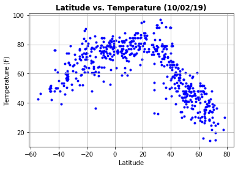
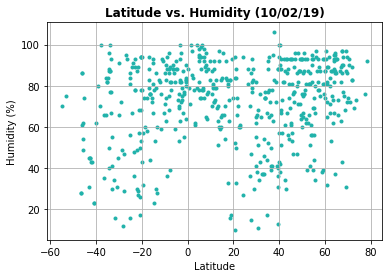
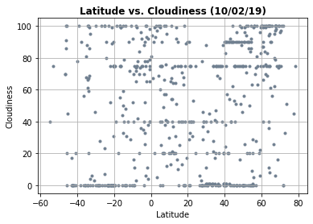
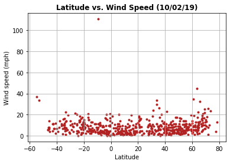

# WeatherPy
----

#### Note
* Instructions have been included for each segment. You do not have to follow them exactly, but they are included to help you think through the steps.


```python
# Dependencies and Setup
import matplotlib.pyplot as plt
import pandas as pd
import numpy as np
import requests
import time
from datetime import date

# Import API key
from api_keys import api_key

# Incorporated citipy to determine city based on latitude and longitude
from citipy import citipy

# Output File (CSV)
output_data_file = "output_data/cities.csv"

# Today's date
today = date.today()

# Range of latitudes and longitudes
lat_range = (-90, 90)
lng_range = (-180, 180)

# url = "https://api.openweathermap.org/"
# url = "http://api.openweathermap.org/data/2.5/weather?"
url = "http://api.openweathermap.org/data/2.5/weather?"
# query_url = f"{url}appid={api_key}"

# Get weather data
# weather_response = requests.get(query_url)
# weather_json = weather_response.json()
# weather_json


```

## Generate Cities List


```python
# List for holding lat_lngs and cities
lat_lngs = []
cities = []

# Create a set of random lat and lng combinations
lats = np.random.uniform(low=-90.000, high=90.000, size=1500)
lngs = np.random.uniform(low=-180.000, high=180.000, size=1500)
lat_lngs = zip(lats, lngs)

# Identify nearest city for each lat, lng combination
for lat_lng in lat_lngs:
    city = citipy.nearest_city(lat_lng[0], lat_lng[1]).city_name
    
    # If the city is unique, then add it to a our cities list
    if city not in cities:
        cities.append(city)

# Print the city count to confirm sufficient count
len(cities)

```


    618


### Perform API Calls
* Perform a weather check on each city using a series of successive API calls.
* Include a print log of each city as it'sbeing processed (with the city number and city name).


```python
names = []
temps = []
winds = []
humids = []
clouds = []
lat = []

for city in cities: #cities.head():
    # Add + 1 because index starts at 0
    city_number = (cities.index(city)) + 1
    #city = city.capitalize()
    print("---------------------")
    print(f"Processing city #{city_number}: {city.capitalize()}")
    adjusted_city = city.replace(" ", "%20")
    query_url = f"{url}appid={api_key}&units=imperial&q={adjusted_city}"
    weather_response = requests.get(query_url)
    weather_json = weather_response.json()
    #names.append(weather_json['name'])
    try:
        print(f"url: {query_url}")
        temps.append(weather_json['main']['temp_max'])
        names.append(weather_json['name'])
        winds.append(weather_json['wind']['speed'])
        humids.append(weather_json['main']['humidity'])
        clouds.append(weather_json['clouds']['all'])
        lat.append(weather_json['coord']['lat'])
    except KeyError:
        print(f"{city.capitalize()} doesn't exist at OpenWeather API")
    

    print(f"Finished processing {city.capitalize()}")
    time.sleep(1)

```

    ---------------------
    Processing city #1: Siguiri
    url: http://api.openweathermap.org/data/2.5/weather?appid=7fd4a4a24b5be08f6fe06eaaafc64a46&units=imperial&q=siguiri
    Finished processing Siguiri
    ---------------------
    Processing city #2: Bluff
    url: http://api.openweathermap.org/data/2.5/weather?appid=7fd4a4a24b5be08f6fe06eaaafc64a46&units=imperial&q=bluff
    Finished processing Bluff
    ---------------------
    Processing city #3: Tual
    url: http://api.openweathermap.org/data/2.5/weather?appid=7fd4a4a24b5be08f6fe06eaaafc64a46&units=imperial&q=tual
    Finished processing Tual
    ---------------------
    Processing city #4: Lebu
    url: http://api.openweathermap.org/data/2.5/weather?appid=7fd4a4a24b5be08f6fe06eaaafc64a46&units=imperial&q=lebu
    Finished processing Lebu
    ---------------------
    Processing city #5: Punta arenas
    url: http://api.openweathermap.org/data/2.5/weather?appid=7fd4a4a24b5be08f6fe06eaaafc64a46&units=imperial&q=punta%20arenas
    Finished processing Punta arenas
    ---------------------
    Processing city #6: Hilo
    url: http://api.openweathermap.org/data/2.5/weather?appid=7fd4a4a24b5be08f6fe06eaaafc64a46&units=imperial&q=hilo
    Finished processing Hilo
    ---------------------
    Processing city #7: Los llanos de aridane
    url: http://api.openweathermap.org/data/2.5/weather?appid=7fd4a4a24b5be08f6fe06eaaafc64a46&units=imperial&q=los%20llanos%20de%20aridane
    Finished processing Los llanos de aridane
    ---------------------
    Processing city #8: Cayenne
    url: http://api.openweathermap.org/data/2.5/weather?appid=7fd4a4a24b5be08f6fe06eaaafc64a46&units=imperial&q=cayenne
    Finished processing Cayenne
    ---------------------
    Processing city #9: Hobart
    url: http://api.openweathermap.org/data/2.5/weather?appid=7fd4a4a24b5be08f6fe06eaaafc64a46&units=imperial&q=hobart
    Finished processing Hobart
    ---------------------
    Processing city #10: Attawapiskat
    url: http://api.openweathermap.org/data/2.5/weather?appid=7fd4a4a24b5be08f6fe06eaaafc64a46&units=imperial&q=attawapiskat
    Attawapiskat doesn't exist at OpenWeather API
    Finished processing Attawapiskat
    ---------------------
    Processing city #11: Dubbo
    url: http://api.openweathermap.org/data/2.5/weather?appid=7fd4a4a24b5be08f6fe06eaaafc64a46&units=imperial&q=dubbo
    Finished processing Dubbo
    ---------------------
    Processing city #12: Jamestown
    url: http://api.openweathermap.org/data/2.5/weather?appid=7fd4a4a24b5be08f6fe06eaaafc64a46&units=imperial&q=jamestown
    Finished processing Jamestown
    ---------------------
    Processing city #13: Luderitz
    url: http://api.openweathermap.org/data/2.5/weather?appid=7fd4a4a24b5be08f6fe06eaaafc64a46&units=imperial&q=luderitz
    Finished processing Luderitz
    ---------------------
    Processing city #14: Catemaco
    url: http://api.openweathermap.org/data/2.5/weather?appid=7fd4a4a24b5be08f6fe06eaaafc64a46&units=imperial&q=catemaco
    Finished processing Catemaco
    ---------------------
    Processing city #15: Talnakh
    url: http://api.openweathermap.org/data/2.5/weather?appid=7fd4a4a24b5be08f6fe06eaaafc64a46&units=imperial&q=talnakh
    Finished processing Talnakh
    ---------------------
    Processing city #16: Kupang
    url: http://api.openweathermap.org/data/2.5/weather?appid=7fd4a4a24b5be08f6fe06eaaafc64a46&units=imperial&q=kupang
    Finished processing Kupang
    ---------------------
    Processing city #17: Karratha
    url: http://api.openweathermap.org/data/2.5/weather?appid=7fd4a4a24b5be08f6fe06eaaafc64a46&units=imperial&q=karratha
    Finished processing Karratha
    ---------------------
    Processing city #18: La gaulette
    url: http://api.openweathermap.org/data/2.5/weather?appid=7fd4a4a24b5be08f6fe06eaaafc64a46&units=imperial&q=la%20gaulette
    La gaulette doesn't exist at OpenWeather API
    Finished processing La gaulette
    ---------------------
    Processing city #19: Ushuaia
    url: http://api.openweathermap.org/data/2.5/weather?appid=7fd4a4a24b5be08f6fe06eaaafc64a46&units=imperial&q=ushuaia
    Finished processing Ushuaia
    ---------------------
    Processing city #20: Ponta do sol
    url: http://api.openweathermap.org/data/2.5/weather?appid=7fd4a4a24b5be08f6fe06eaaafc64a46&units=imperial&q=ponta%20do%20sol
    Finished processing Ponta do sol
    ---------------------
    Processing city #21: Longyearbyen
    url: http://api.openweathermap.org/data/2.5/weather?appid=7fd4a4a24b5be08f6fe06eaaafc64a46&units=imperial&q=longyearbyen
    Finished processing Longyearbyen
    ---------------------
    Processing city #22: Kapaa
    url: http://api.openweathermap.org/data/2.5/weather?appid=7fd4a4a24b5be08f6fe06eaaafc64a46&units=imperial&q=kapaa
    Finished processing Kapaa
    ---------------------
    Processing city #23: Upernavik
    url: http://api.openweathermap.org/data/2.5/weather?appid=7fd4a4a24b5be08f6fe06eaaafc64a46&units=imperial&q=upernavik
    Finished processing Upernavik
    ---------------------
    Processing city #24: Severo-kurilsk
    url: http://api.openweathermap.org/data/2.5/weather?appid=7fd4a4a24b5be08f6fe06eaaafc64a46&units=imperial&q=severo-kurilsk
    Finished processing Severo-kurilsk
    ---------------------
    Processing city #25: Bambanglipuro
    url: http://api.openweathermap.org/data/2.5/weather?appid=7fd4a4a24b5be08f6fe06eaaafc64a46&units=imperial&q=bambanglipuro
    Finished processing Bambanglipuro
    ---------------------
    Processing city #26: Majene
    url: http://api.openweathermap.org/data/2.5/weather?appid=7fd4a4a24b5be08f6fe06eaaafc64a46&units=imperial&q=majene
    Finished processing Majene
    ---------------------
    Processing city #27: Fevralsk
    url: http://api.openweathermap.org/data/2.5/weather?appid=7fd4a4a24b5be08f6fe06eaaafc64a46&units=imperial&q=fevralsk
    Fevralsk doesn't exist at OpenWeather API
    Finished processing Fevralsk
    ---------------------
    Processing city #28: Katsuura
    url: http://api.openweathermap.org/data/2.5/weather?appid=7fd4a4a24b5be08f6fe06eaaafc64a46&units=imperial&q=katsuura
    Finished processing Katsuura
    ---------------------
    Processing city #29: Vostok
    url: http://api.openweathermap.org/data/2.5/weather?appid=7fd4a4a24b5be08f6fe06eaaafc64a46&units=imperial&q=vostok
    Finished processing Vostok
    ---------------------
    Processing city #30: Rikitea
    url: http://api.openweathermap.org/data/2.5/weather?appid=7fd4a4a24b5be08f6fe06eaaafc64a46&units=imperial&q=rikitea
    Finished processing Rikitea
    ---------------------
    Processing city #31: Matara
    url: http://api.openweathermap.org/data/2.5/weather?appid=7fd4a4a24b5be08f6fe06eaaafc64a46&units=imperial&q=matara
    Finished processing Matara
    ---------------------
    Processing city #32: Carnarvon
    url: http://api.openweathermap.org/data/2.5/weather?appid=7fd4a4a24b5be08f6fe06eaaafc64a46&units=imperial&q=carnarvon
    Finished processing Carnarvon
    ---------------------
    Processing city #33: Kodiak
    url: http://api.openweathermap.org/data/2.5/weather?appid=7fd4a4a24b5be08f6fe06eaaafc64a46&units=imperial&q=kodiak
    Finished processing Kodiak
    ---------------------
    Processing city #34: Bathsheba
    url: http://api.openweathermap.org/data/2.5/weather?appid=7fd4a4a24b5be08f6fe06eaaafc64a46&units=imperial&q=bathsheba
    Finished processing Bathsheba
    ---------------------
    Processing city #35: Guerrero negro
    url: http://api.openweathermap.org/data/2.5/weather?appid=7fd4a4a24b5be08f6fe06eaaafc64a46&units=imperial&q=guerrero%20negro
    Finished processing Guerrero negro
    ---------------------
    Processing city #36: Busselton
    url: http://api.openweathermap.org/data/2.5/weather?appid=7fd4a4a24b5be08f6fe06eaaafc64a46&units=imperial&q=busselton
    Finished processing Busselton
    ---------------------
    Processing city #37: Grand river south east
    url: http://api.openweathermap.org/data/2.5/weather?appid=7fd4a4a24b5be08f6fe06eaaafc64a46&units=imperial&q=grand%20river%20south%20east
    Grand river south east doesn't exist at OpenWeather API
    Finished processing Grand river south east
    ---------------------
    Processing city #38: Sobolevo
    url: http://api.openweathermap.org/data/2.5/weather?appid=7fd4a4a24b5be08f6fe06eaaafc64a46&units=imperial&q=sobolevo
    Finished processing Sobolevo
    ---------------------
    Processing city #39: Taolanaro
    url: http://api.openweathermap.org/data/2.5/weather?appid=7fd4a4a24b5be08f6fe06eaaafc64a46&units=imperial&q=taolanaro
    Taolanaro doesn't exist at OpenWeather API
    Finished processing Taolanaro
    ---------------------
    Processing city #40: Mar del plata
    url: http://api.openweathermap.org/data/2.5/weather?appid=7fd4a4a24b5be08f6fe06eaaafc64a46&units=imperial&q=mar%20del%20plata
    Finished processing Mar del plata
    ---------------------
    Processing city #41: Matagami
    url: http://api.openweathermap.org/data/2.5/weather?appid=7fd4a4a24b5be08f6fe06eaaafc64a46&units=imperial&q=matagami
    Finished processing Matagami
    ---------------------
    Processing city #42: Hermanus
    url: http://api.openweathermap.org/data/2.5/weather?appid=7fd4a4a24b5be08f6fe06eaaafc64a46&units=imperial&q=hermanus
    Finished processing Hermanus
    ---------------------
    Processing city #43: El dorado
    url: http://api.openweathermap.org/data/2.5/weather?appid=7fd4a4a24b5be08f6fe06eaaafc64a46&units=imperial&q=el%20dorado
    Finished processing El dorado
    ---------------------
    Processing city #44: Barrow
    url: http://api.openweathermap.org/data/2.5/weather?appid=7fd4a4a24b5be08f6fe06eaaafc64a46&units=imperial&q=barrow
    Finished processing Barrow
    ---------------------
    Processing city #45: Atuona
    url: http://api.openweathermap.org/data/2.5/weather?appid=7fd4a4a24b5be08f6fe06eaaafc64a46&units=imperial&q=atuona
    Finished processing Atuona
    ---------------------
    Processing city #46: Bethel
    url: http://api.openweathermap.org/data/2.5/weather?appid=7fd4a4a24b5be08f6fe06eaaafc64a46&units=imperial&q=bethel
    Finished processing Bethel
    ---------------------
    Processing city #47: Ust-bolsheretsk
    url: http://api.openweathermap.org/data/2.5/weather?appid=7fd4a4a24b5be08f6fe06eaaafc64a46&units=imperial&q=ust-bolsheretsk
    Ust-bolsheretsk doesn't exist at OpenWeather API
    Finished processing Ust-bolsheretsk
    ---------------------
    Processing city #48: Bengkulu
    url: http://api.openweathermap.org/data/2.5/weather?appid=7fd4a4a24b5be08f6fe06eaaafc64a46&units=imperial&q=bengkulu
    Bengkulu doesn't exist at OpenWeather API
    Finished processing Bengkulu
    ---------------------
    Processing city #49: Mataura
    url: http://api.openweathermap.org/data/2.5/weather?appid=7fd4a4a24b5be08f6fe06eaaafc64a46&units=imperial&q=mataura
    Finished processing Mataura
    ---------------------
    Processing city #50: Marsh harbour
    url: http://api.openweathermap.org/data/2.5/weather?appid=7fd4a4a24b5be08f6fe06eaaafc64a46&units=imperial&q=marsh%20harbour
    Finished processing Marsh harbour
    ---------------------
    Processing city #51: Chuguyevka
    url: http://api.openweathermap.org/data/2.5/weather?appid=7fd4a4a24b5be08f6fe06eaaafc64a46&units=imperial&q=chuguyevka
    Finished processing Chuguyevka
    ---------------------
    Processing city #52: Castro
    url: http://api.openweathermap.org/data/2.5/weather?appid=7fd4a4a24b5be08f6fe06eaaafc64a46&units=imperial&q=castro
    Finished processing Castro
    ---------------------
    Processing city #53: Puerto ayora
    url: http://api.openweathermap.org/data/2.5/weather?appid=7fd4a4a24b5be08f6fe06eaaafc64a46&units=imperial&q=puerto%20ayora
    Finished processing Puerto ayora
    ---------------------
    Processing city #54: Victoria
    url: http://api.openweathermap.org/data/2.5/weather?appid=7fd4a4a24b5be08f6fe06eaaafc64a46&units=imperial&q=victoria
    Finished processing Victoria
    ---------------------
    Processing city #55: Albany
    url: http://api.openweathermap.org/data/2.5/weather?appid=7fd4a4a24b5be08f6fe06eaaafc64a46&units=imperial&q=albany
    Finished processing Albany
    ---------------------
    Processing city #56: Maun
    url: http://api.openweathermap.org/data/2.5/weather?appid=7fd4a4a24b5be08f6fe06eaaafc64a46&units=imperial&q=maun
    Finished processing Maun
    ---------------------
    Processing city #57: Levokumskoye
    url: http://api.openweathermap.org/data/2.5/weather?appid=7fd4a4a24b5be08f6fe06eaaafc64a46&units=imperial&q=levokumskoye
    Finished processing Levokumskoye
    ---------------------
    Processing city #58: Belushya guba
    url: http://api.openweathermap.org/data/2.5/weather?appid=7fd4a4a24b5be08f6fe06eaaafc64a46&units=imperial&q=belushya%20guba
    Belushya guba doesn't exist at OpenWeather API
    Finished processing Belushya guba
    ---------------------
    Processing city #59: Esperance
    url: http://api.openweathermap.org/data/2.5/weather?appid=7fd4a4a24b5be08f6fe06eaaafc64a46&units=imperial&q=esperance
    Finished processing Esperance
    ---------------------
    Processing city #60: Kapiri mposhi
    url: http://api.openweathermap.org/data/2.5/weather?appid=7fd4a4a24b5be08f6fe06eaaafc64a46&units=imperial&q=kapiri%20mposhi
    Finished processing Kapiri mposhi
    ---------------------
    Processing city #61: East london
    url: http://api.openweathermap.org/data/2.5/weather?appid=7fd4a4a24b5be08f6fe06eaaafc64a46&units=imperial&q=east%20london
    Finished processing East london
    ---------------------
    Processing city #62: Slave lake
    url: http://api.openweathermap.org/data/2.5/weather?appid=7fd4a4a24b5be08f6fe06eaaafc64a46&units=imperial&q=slave%20lake
    Finished processing Slave lake
    ---------------------
    Processing city #63: Nome
    url: http://api.openweathermap.org/data/2.5/weather?appid=7fd4a4a24b5be08f6fe06eaaafc64a46&units=imperial&q=nome
    Finished processing Nome
    ---------------------
    Processing city #64: Vaini
    url: http://api.openweathermap.org/data/2.5/weather?appid=7fd4a4a24b5be08f6fe06eaaafc64a46&units=imperial&q=vaini
    Finished processing Vaini
    ---------------------
    Processing city #65: Meyungs
    url: http://api.openweathermap.org/data/2.5/weather?appid=7fd4a4a24b5be08f6fe06eaaafc64a46&units=imperial&q=meyungs
    Meyungs doesn't exist at OpenWeather API
    Finished processing Meyungs
    ---------------------
    Processing city #66: Eureka
    url: http://api.openweathermap.org/data/2.5/weather?appid=7fd4a4a24b5be08f6fe06eaaafc64a46&units=imperial&q=eureka
    Finished processing Eureka
    ---------------------
    Processing city #67: Kurayoshi
    url: http://api.openweathermap.org/data/2.5/weather?appid=7fd4a4a24b5be08f6fe06eaaafc64a46&units=imperial&q=kurayoshi
    Finished processing Kurayoshi
    ---------------------
    Processing city #68: Kovdor
    url: http://api.openweathermap.org/data/2.5/weather?appid=7fd4a4a24b5be08f6fe06eaaafc64a46&units=imperial&q=kovdor
    Finished processing Kovdor
    ---------------------
    Processing city #69: Isangel
    url: http://api.openweathermap.org/data/2.5/weather?appid=7fd4a4a24b5be08f6fe06eaaafc64a46&units=imperial&q=isangel
    Finished processing Isangel
    ---------------------
    Processing city #70: Tupik
    url: http://api.openweathermap.org/data/2.5/weather?appid=7fd4a4a24b5be08f6fe06eaaafc64a46&units=imperial&q=tupik
    Finished processing Tupik
    ---------------------
    Processing city #71: Cape town
    url: http://api.openweathermap.org/data/2.5/weather?appid=7fd4a4a24b5be08f6fe06eaaafc64a46&units=imperial&q=cape%20town
    Finished processing Cape town
    ---------------------
    Processing city #72: Geraldton
    url: http://api.openweathermap.org/data/2.5/weather?appid=7fd4a4a24b5be08f6fe06eaaafc64a46&units=imperial&q=geraldton
    Finished processing Geraldton
    ---------------------
    Processing city #73: Ilulissat
    url: http://api.openweathermap.org/data/2.5/weather?appid=7fd4a4a24b5be08f6fe06eaaafc64a46&units=imperial&q=ilulissat
    Finished processing Ilulissat
    ---------------------
    Processing city #74: Iqaluit
    url: http://api.openweathermap.org/data/2.5/weather?appid=7fd4a4a24b5be08f6fe06eaaafc64a46&units=imperial&q=iqaluit
    Finished processing Iqaluit
    ---------------------
    Processing city #75: Eldorado
    url: http://api.openweathermap.org/data/2.5/weather?appid=7fd4a4a24b5be08f6fe06eaaafc64a46&units=imperial&q=eldorado
    Finished processing Eldorado
    ---------------------
    Processing city #76: Pevek
    url: http://api.openweathermap.org/data/2.5/weather?appid=7fd4a4a24b5be08f6fe06eaaafc64a46&units=imperial&q=pevek
    Finished processing Pevek
    ---------------------
    Processing city #77: Qaanaaq
    url: http://api.openweathermap.org/data/2.5/weather?appid=7fd4a4a24b5be08f6fe06eaaafc64a46&units=imperial&q=qaanaaq
    Finished processing Qaanaaq
    ---------------------
    Processing city #78: Moroni
    url: http://api.openweathermap.org/data/2.5/weather?appid=7fd4a4a24b5be08f6fe06eaaafc64a46&units=imperial&q=moroni
    Finished processing Moroni
    ---------------------
    Processing city #79: Gat
    url: http://api.openweathermap.org/data/2.5/weather?appid=7fd4a4a24b5be08f6fe06eaaafc64a46&units=imperial&q=gat
    Finished processing Gat
    ---------------------
    Processing city #80: Atar
    url: http://api.openweathermap.org/data/2.5/weather?appid=7fd4a4a24b5be08f6fe06eaaafc64a46&units=imperial&q=atar
    Finished processing Atar
    ---------------------
    Processing city #81: Husavik
    url: http://api.openweathermap.org/data/2.5/weather?appid=7fd4a4a24b5be08f6fe06eaaafc64a46&units=imperial&q=husavik
    Finished processing Husavik
    ---------------------
    Processing city #82: Saint-augustin
    url: http://api.openweathermap.org/data/2.5/weather?appid=7fd4a4a24b5be08f6fe06eaaafc64a46&units=imperial&q=saint-augustin
    Finished processing Saint-augustin
    ---------------------
    Processing city #83: Cabo san lucas
    url: http://api.openweathermap.org/data/2.5/weather?appid=7fd4a4a24b5be08f6fe06eaaafc64a46&units=imperial&q=cabo%20san%20lucas
    Finished processing Cabo san lucas
    ---------------------
    Processing city #84: Lorengau
    url: http://api.openweathermap.org/data/2.5/weather?appid=7fd4a4a24b5be08f6fe06eaaafc64a46&units=imperial&q=lorengau
    Finished processing Lorengau
    ---------------------
    Processing city #85: Scottsburgh
    url: http://api.openweathermap.org/data/2.5/weather?appid=7fd4a4a24b5be08f6fe06eaaafc64a46&units=imperial&q=scottsburgh
    Scottsburgh doesn't exist at OpenWeather API
    Finished processing Scottsburgh
    ---------------------
    Processing city #86: Vardo
    url: http://api.openweathermap.org/data/2.5/weather?appid=7fd4a4a24b5be08f6fe06eaaafc64a46&units=imperial&q=vardo
    Finished processing Vardo
    ---------------------
    Processing city #87: Amahai
    url: http://api.openweathermap.org/data/2.5/weather?appid=7fd4a4a24b5be08f6fe06eaaafc64a46&units=imperial&q=amahai
    Finished processing Amahai
    ---------------------
    Processing city #88: Deputatskiy
    url: http://api.openweathermap.org/data/2.5/weather?appid=7fd4a4a24b5be08f6fe06eaaafc64a46&units=imperial&q=deputatskiy
    Finished processing Deputatskiy
    ---------------------
    Processing city #89: Sembe
    url: http://api.openweathermap.org/data/2.5/weather?appid=7fd4a4a24b5be08f6fe06eaaafc64a46&units=imperial&q=sembe
    Sembe doesn't exist at OpenWeather API
    Finished processing Sembe
    ---------------------
    Processing city #90: Puerto escondido
    url: http://api.openweathermap.org/data/2.5/weather?appid=7fd4a4a24b5be08f6fe06eaaafc64a46&units=imperial&q=puerto%20escondido
    Finished processing Puerto escondido
    ---------------------
    Processing city #91: Butaritari
    url: http://api.openweathermap.org/data/2.5/weather?appid=7fd4a4a24b5be08f6fe06eaaafc64a46&units=imperial&q=butaritari
    Finished processing Butaritari
    ---------------------
    Processing city #92: Nouadhibou
    url: http://api.openweathermap.org/data/2.5/weather?appid=7fd4a4a24b5be08f6fe06eaaafc64a46&units=imperial&q=nouadhibou
    Finished processing Nouadhibou
    ---------------------
    Processing city #93: Kavieng
    url: http://api.openweathermap.org/data/2.5/weather?appid=7fd4a4a24b5be08f6fe06eaaafc64a46&units=imperial&q=kavieng
    Finished processing Kavieng
    ---------------------
    Processing city #94: Flinders
    url: http://api.openweathermap.org/data/2.5/weather?appid=7fd4a4a24b5be08f6fe06eaaafc64a46&units=imperial&q=flinders
    Finished processing Flinders
    ---------------------
    Processing city #95: Poso
    url: http://api.openweathermap.org/data/2.5/weather?appid=7fd4a4a24b5be08f6fe06eaaafc64a46&units=imperial&q=poso
    Finished processing Poso
    ---------------------
    Processing city #96: Tuktoyaktuk
    url: http://api.openweathermap.org/data/2.5/weather?appid=7fd4a4a24b5be08f6fe06eaaafc64a46&units=imperial&q=tuktoyaktuk
    Finished processing Tuktoyaktuk
    ---------------------
    Processing city #97: Tulsipur
    url: http://api.openweathermap.org/data/2.5/weather?appid=7fd4a4a24b5be08f6fe06eaaafc64a46&units=imperial&q=tulsipur
    Finished processing Tulsipur
    ---------------------
    Processing city #98: Lakselv
    url: http://api.openweathermap.org/data/2.5/weather?appid=7fd4a4a24b5be08f6fe06eaaafc64a46&units=imperial&q=lakselv
    Finished processing Lakselv
    ---------------------
    Processing city #99: Milkovo
    url: http://api.openweathermap.org/data/2.5/weather?appid=7fd4a4a24b5be08f6fe06eaaafc64a46&units=imperial&q=milkovo
    Finished processing Milkovo
    ---------------------
    Processing city #100: Kuhdasht
    url: http://api.openweathermap.org/data/2.5/weather?appid=7fd4a4a24b5be08f6fe06eaaafc64a46&units=imperial&q=kuhdasht
    Finished processing Kuhdasht
    ---------------------
    Processing city #101: Simplicio mendes
    url: http://api.openweathermap.org/data/2.5/weather?appid=7fd4a4a24b5be08f6fe06eaaafc64a46&units=imperial&q=simplicio%20mendes
    Finished processing Simplicio mendes
    ---------------------
    Processing city #102: Novouzensk
    url: http://api.openweathermap.org/data/2.5/weather?appid=7fd4a4a24b5be08f6fe06eaaafc64a46&units=imperial&q=novouzensk
    Finished processing Novouzensk
    ---------------------
    Processing city #103: Snina
    url: http://api.openweathermap.org/data/2.5/weather?appid=7fd4a4a24b5be08f6fe06eaaafc64a46&units=imperial&q=snina
    Finished processing Snina
    ---------------------
    Processing city #104: Jalu
    url: http://api.openweathermap.org/data/2.5/weather?appid=7fd4a4a24b5be08f6fe06eaaafc64a46&units=imperial&q=jalu
    Finished processing Jalu
    ---------------------
    Processing city #105: Quthing
    url: http://api.openweathermap.org/data/2.5/weather?appid=7fd4a4a24b5be08f6fe06eaaafc64a46&units=imperial&q=quthing
    Finished processing Quthing
    ---------------------
    Processing city #106: Bambous virieux
    url: http://api.openweathermap.org/data/2.5/weather?appid=7fd4a4a24b5be08f6fe06eaaafc64a46&units=imperial&q=bambous%20virieux
    Finished processing Bambous virieux
    ---------------------
    Processing city #107: Oum hadjer
    url: http://api.openweathermap.org/data/2.5/weather?appid=7fd4a4a24b5be08f6fe06eaaafc64a46&units=imperial&q=oum%20hadjer
    Finished processing Oum hadjer
    ---------------------
    Processing city #108: Umzimvubu
    url: http://api.openweathermap.org/data/2.5/weather?appid=7fd4a4a24b5be08f6fe06eaaafc64a46&units=imperial&q=umzimvubu
    Umzimvubu doesn't exist at OpenWeather API
    Finished processing Umzimvubu
    ---------------------
    Processing city #109: Amderma
    url: http://api.openweathermap.org/data/2.5/weather?appid=7fd4a4a24b5be08f6fe06eaaafc64a46&units=imperial&q=amderma
    Amderma doesn't exist at OpenWeather API
    Finished processing Amderma
    ---------------------
    Processing city #110: Khatanga
    url: http://api.openweathermap.org/data/2.5/weather?appid=7fd4a4a24b5be08f6fe06eaaafc64a46&units=imperial&q=khatanga
    Finished processing Khatanga
    ---------------------
    Processing city #111: Pathein
    url: http://api.openweathermap.org/data/2.5/weather?appid=7fd4a4a24b5be08f6fe06eaaafc64a46&units=imperial&q=pathein
    Finished processing Pathein
    ---------------------
    Processing city #112: Torbay
    url: http://api.openweathermap.org/data/2.5/weather?appid=7fd4a4a24b5be08f6fe06eaaafc64a46&units=imperial&q=torbay
    Finished processing Torbay
    ---------------------
    Processing city #113: Bull savanna
    url: http://api.openweathermap.org/data/2.5/weather?appid=7fd4a4a24b5be08f6fe06eaaafc64a46&units=imperial&q=bull%20savanna
    Finished processing Bull savanna
    ---------------------
    Processing city #114: Georgetown
    url: http://api.openweathermap.org/data/2.5/weather?appid=7fd4a4a24b5be08f6fe06eaaafc64a46&units=imperial&q=georgetown
    Finished processing Georgetown
    ---------------------
    Processing city #115: Izvestkovyy
    url: http://api.openweathermap.org/data/2.5/weather?appid=7fd4a4a24b5be08f6fe06eaaafc64a46&units=imperial&q=izvestkovyy
    Finished processing Izvestkovyy
    ---------------------
    Processing city #116: Gerzat
    url: http://api.openweathermap.org/data/2.5/weather?appid=7fd4a4a24b5be08f6fe06eaaafc64a46&units=imperial&q=gerzat
    Finished processing Gerzat
    ---------------------
    Processing city #117: Kahului
    url: http://api.openweathermap.org/data/2.5/weather?appid=7fd4a4a24b5be08f6fe06eaaafc64a46&units=imperial&q=kahului
    Finished processing Kahului
    ---------------------
    Processing city #118: Port hardy
    url: http://api.openweathermap.org/data/2.5/weather?appid=7fd4a4a24b5be08f6fe06eaaafc64a46&units=imperial&q=port%20hardy
    Finished processing Port hardy
    ---------------------
    Processing city #119: Saskylakh
    url: http://api.openweathermap.org/data/2.5/weather?appid=7fd4a4a24b5be08f6fe06eaaafc64a46&units=imperial&q=saskylakh
    Finished processing Saskylakh
    ---------------------
    Processing city #120: Kyzyl-suu
    url: http://api.openweathermap.org/data/2.5/weather?appid=7fd4a4a24b5be08f6fe06eaaafc64a46&units=imperial&q=kyzyl-suu
    Finished processing Kyzyl-suu
    ---------------------
    Processing city #121: Saint-philippe
    url: http://api.openweathermap.org/data/2.5/weather?appid=7fd4a4a24b5be08f6fe06eaaafc64a46&units=imperial&q=saint-philippe
    Finished processing Saint-philippe
    ---------------------
    Processing city #122: Grand gaube
    url: http://api.openweathermap.org/data/2.5/weather?appid=7fd4a4a24b5be08f6fe06eaaafc64a46&units=imperial&q=grand%20gaube
    Finished processing Grand gaube
    ---------------------
    Processing city #123: Bahadurganj
    url: http://api.openweathermap.org/data/2.5/weather?appid=7fd4a4a24b5be08f6fe06eaaafc64a46&units=imperial&q=bahadurganj
    Finished processing Bahadurganj
    ---------------------
    Processing city #124: Batagay
    url: http://api.openweathermap.org/data/2.5/weather?appid=7fd4a4a24b5be08f6fe06eaaafc64a46&units=imperial&q=batagay
    Finished processing Batagay
    ---------------------
    Processing city #125: Seoul
    url: http://api.openweathermap.org/data/2.5/weather?appid=7fd4a4a24b5be08f6fe06eaaafc64a46&units=imperial&q=seoul
    Finished processing Seoul
    ---------------------
    Processing city #126: Yelizovo
    url: http://api.openweathermap.org/data/2.5/weather?appid=7fd4a4a24b5be08f6fe06eaaafc64a46&units=imperial&q=yelizovo
    Finished processing Yelizovo
    ---------------------
    Processing city #127: Faanui
    url: http://api.openweathermap.org/data/2.5/weather?appid=7fd4a4a24b5be08f6fe06eaaafc64a46&units=imperial&q=faanui
    Finished processing Faanui
    ---------------------
    Processing city #128: Saint-georges
    url: http://api.openweathermap.org/data/2.5/weather?appid=7fd4a4a24b5be08f6fe06eaaafc64a46&units=imperial&q=saint-georges
    Finished processing Saint-georges
    ---------------------
    Processing city #129: Cherskiy
    url: http://api.openweathermap.org/data/2.5/weather?appid=7fd4a4a24b5be08f6fe06eaaafc64a46&units=imperial&q=cherskiy
    Finished processing Cherskiy
    ---------------------
    Processing city #130: Oriximina
    url: http://api.openweathermap.org/data/2.5/weather?appid=7fd4a4a24b5be08f6fe06eaaafc64a46&units=imperial&q=oriximina
    Finished processing Oriximina
    ---------------------
    Processing city #131: Shimoda
    url: http://api.openweathermap.org/data/2.5/weather?appid=7fd4a4a24b5be08f6fe06eaaafc64a46&units=imperial&q=shimoda
    Finished processing Shimoda
    ---------------------
    Processing city #132: Nikolskoye
    url: http://api.openweathermap.org/data/2.5/weather?appid=7fd4a4a24b5be08f6fe06eaaafc64a46&units=imperial&q=nikolskoye
    Finished processing Nikolskoye
    ---------------------
    Processing city #133: Padang
    url: http://api.openweathermap.org/data/2.5/weather?appid=7fd4a4a24b5be08f6fe06eaaafc64a46&units=imperial&q=padang
    Finished processing Padang
    ---------------------
    Processing city #134: Pandan
    url: http://api.openweathermap.org/data/2.5/weather?appid=7fd4a4a24b5be08f6fe06eaaafc64a46&units=imperial&q=pandan
    Finished processing Pandan
    ---------------------
    Processing city #135: San ramon
    url: http://api.openweathermap.org/data/2.5/weather?appid=7fd4a4a24b5be08f6fe06eaaafc64a46&units=imperial&q=san%20ramon
    Finished processing San ramon
    ---------------------
    Processing city #136: Yellowknife
    url: http://api.openweathermap.org/data/2.5/weather?appid=7fd4a4a24b5be08f6fe06eaaafc64a46&units=imperial&q=yellowknife
    Finished processing Yellowknife
    ---------------------
    Processing city #137: Chambersburg
    url: http://api.openweathermap.org/data/2.5/weather?appid=7fd4a4a24b5be08f6fe06eaaafc64a46&units=imperial&q=chambersburg
    Finished processing Chambersburg
    ---------------------
    Processing city #138: Tura
    url: http://api.openweathermap.org/data/2.5/weather?appid=7fd4a4a24b5be08f6fe06eaaafc64a46&units=imperial&q=tura
    Finished processing Tura
    ---------------------
    Processing city #139: Rabak
    url: http://api.openweathermap.org/data/2.5/weather?appid=7fd4a4a24b5be08f6fe06eaaafc64a46&units=imperial&q=rabak
    Finished processing Rabak
    ---------------------
    Processing city #140: Edd
    url: http://api.openweathermap.org/data/2.5/weather?appid=7fd4a4a24b5be08f6fe06eaaafc64a46&units=imperial&q=edd
    Finished processing Edd
    ---------------------
    Processing city #141: Pirajui
    url: http://api.openweathermap.org/data/2.5/weather?appid=7fd4a4a24b5be08f6fe06eaaafc64a46&units=imperial&q=pirajui
    Finished processing Pirajui
    ---------------------
    Processing city #142: Chuy
    url: http://api.openweathermap.org/data/2.5/weather?appid=7fd4a4a24b5be08f6fe06eaaafc64a46&units=imperial&q=chuy
    Finished processing Chuy
    ---------------------
    Processing city #143: Manono
    url: http://api.openweathermap.org/data/2.5/weather?appid=7fd4a4a24b5be08f6fe06eaaafc64a46&units=imperial&q=manono
    Finished processing Manono
    ---------------------
    Processing city #144: Caravelas
    url: http://api.openweathermap.org/data/2.5/weather?appid=7fd4a4a24b5be08f6fe06eaaafc64a46&units=imperial&q=caravelas
    Finished processing Caravelas
    ---------------------
    Processing city #145: Buala
    url: http://api.openweathermap.org/data/2.5/weather?appid=7fd4a4a24b5be08f6fe06eaaafc64a46&units=imperial&q=buala
    Finished processing Buala
    ---------------------
    Processing city #146: Itupiranga
    url: http://api.openweathermap.org/data/2.5/weather?appid=7fd4a4a24b5be08f6fe06eaaafc64a46&units=imperial&q=itupiranga
    Finished processing Itupiranga
    ---------------------
    Processing city #147: Hithadhoo
    url: http://api.openweathermap.org/data/2.5/weather?appid=7fd4a4a24b5be08f6fe06eaaafc64a46&units=imperial&q=hithadhoo
    Finished processing Hithadhoo
    ---------------------
    Processing city #148: Kharp
    url: http://api.openweathermap.org/data/2.5/weather?appid=7fd4a4a24b5be08f6fe06eaaafc64a46&units=imperial&q=kharp
    Finished processing Kharp
    ---------------------
    Processing city #149: Ajdabiya
    url: http://api.openweathermap.org/data/2.5/weather?appid=7fd4a4a24b5be08f6fe06eaaafc64a46&units=imperial&q=ajdabiya
    Finished processing Ajdabiya
    ---------------------
    Processing city #150: Chongwe
    url: http://api.openweathermap.org/data/2.5/weather?appid=7fd4a4a24b5be08f6fe06eaaafc64a46&units=imperial&q=chongwe
    Finished processing Chongwe
    ---------------------
    Processing city #151: Vanavara
    url: http://api.openweathermap.org/data/2.5/weather?appid=7fd4a4a24b5be08f6fe06eaaafc64a46&units=imperial&q=vanavara
    Finished processing Vanavara
    ---------------------
    Processing city #152: Nivala
    url: http://api.openweathermap.org/data/2.5/weather?appid=7fd4a4a24b5be08f6fe06eaaafc64a46&units=imperial&q=nivala
    Finished processing Nivala
    ---------------------
    Processing city #153: Wakema
    url: http://api.openweathermap.org/data/2.5/weather?appid=7fd4a4a24b5be08f6fe06eaaafc64a46&units=imperial&q=wakema
    Finished processing Wakema
    ---------------------
    Processing city #154: Salalah
    url: http://api.openweathermap.org/data/2.5/weather?appid=7fd4a4a24b5be08f6fe06eaaafc64a46&units=imperial&q=salalah
    Finished processing Salalah
    ---------------------
    Processing city #155: Thompson
    url: http://api.openweathermap.org/data/2.5/weather?appid=7fd4a4a24b5be08f6fe06eaaafc64a46&units=imperial&q=thompson
    Finished processing Thompson
    ---------------------
    Processing city #156: Boditi
    url: http://api.openweathermap.org/data/2.5/weather?appid=7fd4a4a24b5be08f6fe06eaaafc64a46&units=imperial&q=boditi
    Finished processing Boditi
    ---------------------
    Processing city #157: Gazli
    url: http://api.openweathermap.org/data/2.5/weather?appid=7fd4a4a24b5be08f6fe06eaaafc64a46&units=imperial&q=gazli
    Finished processing Gazli
    ---------------------
    Processing city #158: Miguel calmon
    url: http://api.openweathermap.org/data/2.5/weather?appid=7fd4a4a24b5be08f6fe06eaaafc64a46&units=imperial&q=miguel%20calmon
    Finished processing Miguel calmon
    ---------------------
    Processing city #159: Nsanje
    url: http://api.openweathermap.org/data/2.5/weather?appid=7fd4a4a24b5be08f6fe06eaaafc64a46&units=imperial&q=nsanje
    Finished processing Nsanje
    ---------------------
    Processing city #160: Bredasdorp
    url: http://api.openweathermap.org/data/2.5/weather?appid=7fd4a4a24b5be08f6fe06eaaafc64a46&units=imperial&q=bredasdorp
    Finished processing Bredasdorp
    ---------------------
    Processing city #161: Santiago del estero
    url: http://api.openweathermap.org/data/2.5/weather?appid=7fd4a4a24b5be08f6fe06eaaafc64a46&units=imperial&q=santiago%20del%20estero
    Finished processing Santiago del estero
    ---------------------
    Processing city #162: Port alfred
    url: http://api.openweathermap.org/data/2.5/weather?appid=7fd4a4a24b5be08f6fe06eaaafc64a46&units=imperial&q=port%20alfred
    Finished processing Port alfred
    ---------------------
    Processing city #163: Lujan
    url: http://api.openweathermap.org/data/2.5/weather?appid=7fd4a4a24b5be08f6fe06eaaafc64a46&units=imperial&q=lujan
    Finished processing Lujan
    ---------------------
    Processing city #164: Asau
    url: http://api.openweathermap.org/data/2.5/weather?appid=7fd4a4a24b5be08f6fe06eaaafc64a46&units=imperial&q=asau
    Asau doesn't exist at OpenWeather API
    Finished processing Asau
    ---------------------
    Processing city #165: Bowen
    url: http://api.openweathermap.org/data/2.5/weather?appid=7fd4a4a24b5be08f6fe06eaaafc64a46&units=imperial&q=bowen
    Finished processing Bowen
    ---------------------
    Processing city #166: Ribeira grande
    url: http://api.openweathermap.org/data/2.5/weather?appid=7fd4a4a24b5be08f6fe06eaaafc64a46&units=imperial&q=ribeira%20grande
    Finished processing Ribeira grande
    ---------------------
    Processing city #167: Malanje
    url: http://api.openweathermap.org/data/2.5/weather?appid=7fd4a4a24b5be08f6fe06eaaafc64a46&units=imperial&q=malanje
    Finished processing Malanje
    ---------------------
    Processing city #168: Tallahassee
    url: http://api.openweathermap.org/data/2.5/weather?appid=7fd4a4a24b5be08f6fe06eaaafc64a46&units=imperial&q=tallahassee
    Finished processing Tallahassee
    ---------------------
    Processing city #169: Narsaq
    url: http://api.openweathermap.org/data/2.5/weather?appid=7fd4a4a24b5be08f6fe06eaaafc64a46&units=imperial&q=narsaq
    Finished processing Narsaq
    ---------------------
    Processing city #170: Broken hill
    url: http://api.openweathermap.org/data/2.5/weather?appid=7fd4a4a24b5be08f6fe06eaaafc64a46&units=imperial&q=broken%20hill
    Finished processing Broken hill
    ---------------------
    Processing city #171: Illoqqortoormiut
    url: http://api.openweathermap.org/data/2.5/weather?appid=7fd4a4a24b5be08f6fe06eaaafc64a46&units=imperial&q=illoqqortoormiut
    Illoqqortoormiut doesn't exist at OpenWeather API
    Finished processing Illoqqortoormiut
    ---------------------
    Processing city #172: Inhambane
    url: http://api.openweathermap.org/data/2.5/weather?appid=7fd4a4a24b5be08f6fe06eaaafc64a46&units=imperial&q=inhambane
    Finished processing Inhambane
    ---------------------
    Processing city #173: Vegreville
    url: http://api.openweathermap.org/data/2.5/weather?appid=7fd4a4a24b5be08f6fe06eaaafc64a46&units=imperial&q=vegreville
    Finished processing Vegreville
    ---------------------
    Processing city #174: Teknaf
    url: http://api.openweathermap.org/data/2.5/weather?appid=7fd4a4a24b5be08f6fe06eaaafc64a46&units=imperial&q=teknaf
    Finished processing Teknaf
    ---------------------
    Processing city #175: Avarua
    url: http://api.openweathermap.org/data/2.5/weather?appid=7fd4a4a24b5be08f6fe06eaaafc64a46&units=imperial&q=avarua
    Finished processing Avarua
    ---------------------
    Processing city #176: Dikson
    url: http://api.openweathermap.org/data/2.5/weather?appid=7fd4a4a24b5be08f6fe06eaaafc64a46&units=imperial&q=dikson
    Finished processing Dikson
    ---------------------
    Processing city #177: Salisbury
    url: http://api.openweathermap.org/data/2.5/weather?appid=7fd4a4a24b5be08f6fe06eaaafc64a46&units=imperial&q=salisbury
    Finished processing Salisbury
    ---------------------
    Processing city #178: Mahebourg
    url: http://api.openweathermap.org/data/2.5/weather?appid=7fd4a4a24b5be08f6fe06eaaafc64a46&units=imperial&q=mahebourg
    Finished processing Mahebourg
    ---------------------
    Processing city #179: Kerki
    url: http://api.openweathermap.org/data/2.5/weather?appid=7fd4a4a24b5be08f6fe06eaaafc64a46&units=imperial&q=kerki
    Kerki doesn't exist at OpenWeather API
    Finished processing Kerki
    ---------------------
    Processing city #180: Berlevag
    url: http://api.openweathermap.org/data/2.5/weather?appid=7fd4a4a24b5be08f6fe06eaaafc64a46&units=imperial&q=berlevag
    Finished processing Berlevag
    ---------------------
    Processing city #181: Provideniya
    url: http://api.openweathermap.org/data/2.5/weather?appid=7fd4a4a24b5be08f6fe06eaaafc64a46&units=imperial&q=provideniya
    Finished processing Provideniya
    ---------------------
    Processing city #182: Maragogi
    url: http://api.openweathermap.org/data/2.5/weather?appid=7fd4a4a24b5be08f6fe06eaaafc64a46&units=imperial&q=maragogi
    Finished processing Maragogi
    ---------------------
    Processing city #183: Dingle
    url: http://api.openweathermap.org/data/2.5/weather?appid=7fd4a4a24b5be08f6fe06eaaafc64a46&units=imperial&q=dingle
    Finished processing Dingle
    ---------------------
    Processing city #184: Barabash
    url: http://api.openweathermap.org/data/2.5/weather?appid=7fd4a4a24b5be08f6fe06eaaafc64a46&units=imperial&q=barabash
    Finished processing Barabash
    ---------------------
    Processing city #185: Didwana
    url: http://api.openweathermap.org/data/2.5/weather?appid=7fd4a4a24b5be08f6fe06eaaafc64a46&units=imperial&q=didwana
    Finished processing Didwana
    ---------------------
    Processing city #186: Loa janan
    url: http://api.openweathermap.org/data/2.5/weather?appid=7fd4a4a24b5be08f6fe06eaaafc64a46&units=imperial&q=loa%20janan
    Finished processing Loa janan
    ---------------------
    Processing city #187: Fare
    url: http://api.openweathermap.org/data/2.5/weather?appid=7fd4a4a24b5be08f6fe06eaaafc64a46&units=imperial&q=fare
    Finished processing Fare
    ---------------------
    Processing city #188: Kailua
    url: http://api.openweathermap.org/data/2.5/weather?appid=7fd4a4a24b5be08f6fe06eaaafc64a46&units=imperial&q=kailua
    Finished processing Kailua
    ---------------------
    Processing city #189: Jinxiang
    url: http://api.openweathermap.org/data/2.5/weather?appid=7fd4a4a24b5be08f6fe06eaaafc64a46&units=imperial&q=jinxiang
    Finished processing Jinxiang
    ---------------------
    Processing city #190: Norman wells
    url: http://api.openweathermap.org/data/2.5/weather?appid=7fd4a4a24b5be08f6fe06eaaafc64a46&units=imperial&q=norman%20wells
    Finished processing Norman wells
    ---------------------
    Processing city #191: Coihaique
    url: http://api.openweathermap.org/data/2.5/weather?appid=7fd4a4a24b5be08f6fe06eaaafc64a46&units=imperial&q=coihaique
    Finished processing Coihaique
    ---------------------
    Processing city #192: Mackay
    url: http://api.openweathermap.org/data/2.5/weather?appid=7fd4a4a24b5be08f6fe06eaaafc64a46&units=imperial&q=mackay
    Finished processing Mackay
    ---------------------
    Processing city #193: Poddorye
    url: http://api.openweathermap.org/data/2.5/weather?appid=7fd4a4a24b5be08f6fe06eaaafc64a46&units=imperial&q=poddorye
    Finished processing Poddorye
    ---------------------
    Processing city #194: Barentsburg
    url: http://api.openweathermap.org/data/2.5/weather?appid=7fd4a4a24b5be08f6fe06eaaafc64a46&units=imperial&q=barentsburg
    Barentsburg doesn't exist at OpenWeather API
    Finished processing Barentsburg
    ---------------------
    Processing city #195: Svetlaya
    url: http://api.openweathermap.org/data/2.5/weather?appid=7fd4a4a24b5be08f6fe06eaaafc64a46&units=imperial&q=svetlaya
    Finished processing Svetlaya
    ---------------------
    Processing city #196: Dalvik
    url: http://api.openweathermap.org/data/2.5/weather?appid=7fd4a4a24b5be08f6fe06eaaafc64a46&units=imperial&q=dalvik
    Finished processing Dalvik
    ---------------------
    Processing city #197: Samusu
    url: http://api.openweathermap.org/data/2.5/weather?appid=7fd4a4a24b5be08f6fe06eaaafc64a46&units=imperial&q=samusu
    Samusu doesn't exist at OpenWeather API
    Finished processing Samusu
    ---------------------
    Processing city #198: Avera
    url: http://api.openweathermap.org/data/2.5/weather?appid=7fd4a4a24b5be08f6fe06eaaafc64a46&units=imperial&q=avera
    Finished processing Avera
    ---------------------
    Processing city #199: Shenjiamen
    url: http://api.openweathermap.org/data/2.5/weather?appid=7fd4a4a24b5be08f6fe06eaaafc64a46&units=imperial&q=shenjiamen
    Finished processing Shenjiamen
    ---------------------
    Processing city #200: Mehran
    url: http://api.openweathermap.org/data/2.5/weather?appid=7fd4a4a24b5be08f6fe06eaaafc64a46&units=imperial&q=mehran
    Finished processing Mehran
    ---------------------
    Processing city #201: Marcona
    url: http://api.openweathermap.org/data/2.5/weather?appid=7fd4a4a24b5be08f6fe06eaaafc64a46&units=imperial&q=marcona
    Marcona doesn't exist at OpenWeather API
    Finished processing Marcona
    ---------------------
    Processing city #202: Ayer itam
    url: http://api.openweathermap.org/data/2.5/weather?appid=7fd4a4a24b5be08f6fe06eaaafc64a46&units=imperial&q=ayer%20itam
    Ayer itam doesn't exist at OpenWeather API
    Finished processing Ayer itam
    ---------------------
    Processing city #203: Athabasca
    url: http://api.openweathermap.org/data/2.5/weather?appid=7fd4a4a24b5be08f6fe06eaaafc64a46&units=imperial&q=athabasca
    Finished processing Athabasca
    ---------------------
    Processing city #204: Sandwick
    url: http://api.openweathermap.org/data/2.5/weather?appid=7fd4a4a24b5be08f6fe06eaaafc64a46&units=imperial&q=sandwick
    Finished processing Sandwick
    ---------------------
    Processing city #205: Junnar
    url: http://api.openweathermap.org/data/2.5/weather?appid=7fd4a4a24b5be08f6fe06eaaafc64a46&units=imperial&q=junnar
    Finished processing Junnar
    ---------------------
    Processing city #206: Lucea
    url: http://api.openweathermap.org/data/2.5/weather?appid=7fd4a4a24b5be08f6fe06eaaafc64a46&units=imperial&q=lucea
    Finished processing Lucea
    ---------------------
    Processing city #207: Ucluelet
    url: http://api.openweathermap.org/data/2.5/weather?appid=7fd4a4a24b5be08f6fe06eaaafc64a46&units=imperial&q=ucluelet
    Finished processing Ucluelet
    ---------------------
    Processing city #208: Fortuna
    url: http://api.openweathermap.org/data/2.5/weather?appid=7fd4a4a24b5be08f6fe06eaaafc64a46&units=imperial&q=fortuna
    Finished processing Fortuna
    ---------------------
    Processing city #209: Shahrud
    url: http://api.openweathermap.org/data/2.5/weather?appid=7fd4a4a24b5be08f6fe06eaaafc64a46&units=imperial&q=shahrud
    Finished processing Shahrud
    ---------------------
    Processing city #210: Nguiu
    url: http://api.openweathermap.org/data/2.5/weather?appid=7fd4a4a24b5be08f6fe06eaaafc64a46&units=imperial&q=nguiu
    Nguiu doesn't exist at OpenWeather API
    Finished processing Nguiu
    ---------------------
    Processing city #211: Whitehorse
    url: http://api.openweathermap.org/data/2.5/weather?appid=7fd4a4a24b5be08f6fe06eaaafc64a46&units=imperial&q=whitehorse
    Finished processing Whitehorse
    ---------------------
    Processing city #212: Lensk
    url: http://api.openweathermap.org/data/2.5/weather?appid=7fd4a4a24b5be08f6fe06eaaafc64a46&units=imperial&q=lensk
    Finished processing Lensk
    ---------------------
    Processing city #213: Zhezkazgan
    url: http://api.openweathermap.org/data/2.5/weather?appid=7fd4a4a24b5be08f6fe06eaaafc64a46&units=imperial&q=zhezkazgan
    Finished processing Zhezkazgan
    ---------------------
    Processing city #214: Ambovombe
    url: http://api.openweathermap.org/data/2.5/weather?appid=7fd4a4a24b5be08f6fe06eaaafc64a46&units=imperial&q=ambovombe
    Finished processing Ambovombe
    ---------------------
    Processing city #215: Namwala
    url: http://api.openweathermap.org/data/2.5/weather?appid=7fd4a4a24b5be08f6fe06eaaafc64a46&units=imperial&q=namwala
    Finished processing Namwala
    ---------------------
    Processing city #216: Codrington
    url: http://api.openweathermap.org/data/2.5/weather?appid=7fd4a4a24b5be08f6fe06eaaafc64a46&units=imperial&q=codrington
    Finished processing Codrington
    ---------------------
    Processing city #217: Saint george
    url: http://api.openweathermap.org/data/2.5/weather?appid=7fd4a4a24b5be08f6fe06eaaafc64a46&units=imperial&q=saint%20george
    Finished processing Saint george
    ---------------------
    Processing city #218: Kununurra
    url: http://api.openweathermap.org/data/2.5/weather?appid=7fd4a4a24b5be08f6fe06eaaafc64a46&units=imperial&q=kununurra
    Finished processing Kununurra
    ---------------------
    Processing city #219: Ambulu
    url: http://api.openweathermap.org/data/2.5/weather?appid=7fd4a4a24b5be08f6fe06eaaafc64a46&units=imperial&q=ambulu
    Finished processing Ambulu
    ---------------------
    Processing city #220: Sharlyk
    url: http://api.openweathermap.org/data/2.5/weather?appid=7fd4a4a24b5be08f6fe06eaaafc64a46&units=imperial&q=sharlyk
    Finished processing Sharlyk
    ---------------------
    Processing city #221: Nishihara
    url: http://api.openweathermap.org/data/2.5/weather?appid=7fd4a4a24b5be08f6fe06eaaafc64a46&units=imperial&q=nishihara
    Finished processing Nishihara
    ---------------------
    Processing city #222: Vaitape
    url: http://api.openweathermap.org/data/2.5/weather?appid=7fd4a4a24b5be08f6fe06eaaafc64a46&units=imperial&q=vaitape
    Finished processing Vaitape
    ---------------------
    Processing city #223: Port elizabeth
    url: http://api.openweathermap.org/data/2.5/weather?appid=7fd4a4a24b5be08f6fe06eaaafc64a46&units=imperial&q=port%20elizabeth
    Finished processing Port elizabeth
    ---------------------
    Processing city #224: San-pedro
    url: http://api.openweathermap.org/data/2.5/weather?appid=7fd4a4a24b5be08f6fe06eaaafc64a46&units=imperial&q=san-pedro
    Finished processing San-pedro
    ---------------------
    Processing city #225: Tiksi
    url: http://api.openweathermap.org/data/2.5/weather?appid=7fd4a4a24b5be08f6fe06eaaafc64a46&units=imperial&q=tiksi
    Finished processing Tiksi
    ---------------------
    Processing city #226: Abnub
    url: http://api.openweathermap.org/data/2.5/weather?appid=7fd4a4a24b5be08f6fe06eaaafc64a46&units=imperial&q=abnub
    Finished processing Abnub
    ---------------------
    Processing city #227: Eisenberg
    url: http://api.openweathermap.org/data/2.5/weather?appid=7fd4a4a24b5be08f6fe06eaaafc64a46&units=imperial&q=eisenberg
    Finished processing Eisenberg
    ---------------------
    Processing city #228: Meulaboh
    url: http://api.openweathermap.org/data/2.5/weather?appid=7fd4a4a24b5be08f6fe06eaaafc64a46&units=imperial&q=meulaboh
    Finished processing Meulaboh
    ---------------------
    Processing city #229: Chokurdakh
    url: http://api.openweathermap.org/data/2.5/weather?appid=7fd4a4a24b5be08f6fe06eaaafc64a46&units=imperial&q=chokurdakh
    Finished processing Chokurdakh
    ---------------------
    Processing city #230: Nanortalik
    url: http://api.openweathermap.org/data/2.5/weather?appid=7fd4a4a24b5be08f6fe06eaaafc64a46&units=imperial&q=nanortalik
    Finished processing Nanortalik
    ---------------------
    Processing city #231: Buchanan
    url: http://api.openweathermap.org/data/2.5/weather?appid=7fd4a4a24b5be08f6fe06eaaafc64a46&units=imperial&q=buchanan
    Finished processing Buchanan
    ---------------------
    Processing city #232: Sakakah
    url: http://api.openweathermap.org/data/2.5/weather?appid=7fd4a4a24b5be08f6fe06eaaafc64a46&units=imperial&q=sakakah
    Sakakah doesn't exist at OpenWeather API
    Finished processing Sakakah
    ---------------------
    Processing city #233: Mayo
    url: http://api.openweathermap.org/data/2.5/weather?appid=7fd4a4a24b5be08f6fe06eaaafc64a46&units=imperial&q=mayo
    Finished processing Mayo
    ---------------------
    Processing city #234: Sao filipe
    url: http://api.openweathermap.org/data/2.5/weather?appid=7fd4a4a24b5be08f6fe06eaaafc64a46&units=imperial&q=sao%20filipe
    Finished processing Sao filipe
    ---------------------
    Processing city #235: Alofi
    url: http://api.openweathermap.org/data/2.5/weather?appid=7fd4a4a24b5be08f6fe06eaaafc64a46&units=imperial&q=alofi
    Finished processing Alofi
    ---------------------
    Processing city #236: La ronge
    url: http://api.openweathermap.org/data/2.5/weather?appid=7fd4a4a24b5be08f6fe06eaaafc64a46&units=imperial&q=la%20ronge
    Finished processing La ronge
    ---------------------
    Processing city #237: New norfolk
    url: http://api.openweathermap.org/data/2.5/weather?appid=7fd4a4a24b5be08f6fe06eaaafc64a46&units=imperial&q=new%20norfolk
    Finished processing New norfolk
    ---------------------
    Processing city #238: Galgani
    url: http://api.openweathermap.org/data/2.5/weather?appid=7fd4a4a24b5be08f6fe06eaaafc64a46&units=imperial&q=galgani
    Galgani doesn't exist at OpenWeather API
    Finished processing Galgani
    ---------------------
    Processing city #239: Cidreira
    url: http://api.openweathermap.org/data/2.5/weather?appid=7fd4a4a24b5be08f6fe06eaaafc64a46&units=imperial&q=cidreira
    Finished processing Cidreira
    ---------------------
    Processing city #240: Kalmunai
    url: http://api.openweathermap.org/data/2.5/weather?appid=7fd4a4a24b5be08f6fe06eaaafc64a46&units=imperial&q=kalmunai
    Finished processing Kalmunai
    ---------------------
    Processing city #241: Namatanai
    url: http://api.openweathermap.org/data/2.5/weather?appid=7fd4a4a24b5be08f6fe06eaaafc64a46&units=imperial&q=namatanai
    Finished processing Namatanai
    ---------------------
    Processing city #242: Berdigestyakh
    url: http://api.openweathermap.org/data/2.5/weather?appid=7fd4a4a24b5be08f6fe06eaaafc64a46&units=imperial&q=berdigestyakh
    Finished processing Berdigestyakh
    ---------------------
    Processing city #243: Algiers
    url: http://api.openweathermap.org/data/2.5/weather?appid=7fd4a4a24b5be08f6fe06eaaafc64a46&units=imperial&q=algiers
    Finished processing Algiers
    ---------------------
    Processing city #244: Troitskiy
    url: http://api.openweathermap.org/data/2.5/weather?appid=7fd4a4a24b5be08f6fe06eaaafc64a46&units=imperial&q=troitskiy
    Finished processing Troitskiy
    ---------------------
    Processing city #245: Jiroft
    url: http://api.openweathermap.org/data/2.5/weather?appid=7fd4a4a24b5be08f6fe06eaaafc64a46&units=imperial&q=jiroft
    Jiroft doesn't exist at OpenWeather API
    Finished processing Jiroft
    ---------------------
    Processing city #246: Algeciras
    url: http://api.openweathermap.org/data/2.5/weather?appid=7fd4a4a24b5be08f6fe06eaaafc64a46&units=imperial&q=algeciras
    Finished processing Algeciras
    ---------------------
    Processing city #247: Chapais
    url: http://api.openweathermap.org/data/2.5/weather?appid=7fd4a4a24b5be08f6fe06eaaafc64a46&units=imperial&q=chapais
    Finished processing Chapais
    ---------------------
    Processing city #248: Marzuq
    url: http://api.openweathermap.org/data/2.5/weather?appid=7fd4a4a24b5be08f6fe06eaaafc64a46&units=imperial&q=marzuq
    Finished processing Marzuq
    ---------------------
    Processing city #249: Baiculesti
    url: http://api.openweathermap.org/data/2.5/weather?appid=7fd4a4a24b5be08f6fe06eaaafc64a46&units=imperial&q=baiculesti
    Finished processing Baiculesti
    ---------------------
    Processing city #250: Tumannyy
    url: http://api.openweathermap.org/data/2.5/weather?appid=7fd4a4a24b5be08f6fe06eaaafc64a46&units=imperial&q=tumannyy
    Tumannyy doesn't exist at OpenWeather API
    Finished processing Tumannyy
    ---------------------
    Processing city #251: Kieta
    url: http://api.openweathermap.org/data/2.5/weather?appid=7fd4a4a24b5be08f6fe06eaaafc64a46&units=imperial&q=kieta
    Finished processing Kieta
    ---------------------
    Processing city #252: Waingapu
    url: http://api.openweathermap.org/data/2.5/weather?appid=7fd4a4a24b5be08f6fe06eaaafc64a46&units=imperial&q=waingapu
    Finished processing Waingapu
    ---------------------
    Processing city #253: Vila franca do campo
    url: http://api.openweathermap.org/data/2.5/weather?appid=7fd4a4a24b5be08f6fe06eaaafc64a46&units=imperial&q=vila%20franca%20do%20campo
    Finished processing Vila franca do campo
    ---------------------
    Processing city #254: Zarand
    url: http://api.openweathermap.org/data/2.5/weather?appid=7fd4a4a24b5be08f6fe06eaaafc64a46&units=imperial&q=zarand
    Finished processing Zarand
    ---------------------
    Processing city #255: George
    url: http://api.openweathermap.org/data/2.5/weather?appid=7fd4a4a24b5be08f6fe06eaaafc64a46&units=imperial&q=george
    Finished processing George
    ---------------------
    Processing city #256: Niort
    url: http://api.openweathermap.org/data/2.5/weather?appid=7fd4a4a24b5be08f6fe06eaaafc64a46&units=imperial&q=niort
    Finished processing Niort
    ---------------------
    Processing city #257: Kotagiri
    url: http://api.openweathermap.org/data/2.5/weather?appid=7fd4a4a24b5be08f6fe06eaaafc64a46&units=imperial&q=kotagiri
    Finished processing Kotagiri
    ---------------------
    Processing city #258: Karaton
    url: http://api.openweathermap.org/data/2.5/weather?appid=7fd4a4a24b5be08f6fe06eaaafc64a46&units=imperial&q=karaton
    Finished processing Karaton
    ---------------------
    Processing city #259: Kraslava
    url: http://api.openweathermap.org/data/2.5/weather?appid=7fd4a4a24b5be08f6fe06eaaafc64a46&units=imperial&q=kraslava
    Finished processing Kraslava
    ---------------------
    Processing city #260: Gouyave
    url: http://api.openweathermap.org/data/2.5/weather?appid=7fd4a4a24b5be08f6fe06eaaafc64a46&units=imperial&q=gouyave
    Finished processing Gouyave
    ---------------------
    Processing city #261: Truckee
    url: http://api.openweathermap.org/data/2.5/weather?appid=7fd4a4a24b5be08f6fe06eaaafc64a46&units=imperial&q=truckee
    Finished processing Truckee
    ---------------------
    Processing city #262: Port lincoln
    url: http://api.openweathermap.org/data/2.5/weather?appid=7fd4a4a24b5be08f6fe06eaaafc64a46&units=imperial&q=port%20lincoln
    Finished processing Port lincoln
    ---------------------
    Processing city #263: Tasiilaq
    url: http://api.openweathermap.org/data/2.5/weather?appid=7fd4a4a24b5be08f6fe06eaaafc64a46&units=imperial&q=tasiilaq
    Finished processing Tasiilaq
    ---------------------
    Processing city #264: Tuatapere
    url: http://api.openweathermap.org/data/2.5/weather?appid=7fd4a4a24b5be08f6fe06eaaafc64a46&units=imperial&q=tuatapere
    Finished processing Tuatapere
    ---------------------
    Processing city #265: Lata
    url: http://api.openweathermap.org/data/2.5/weather?appid=7fd4a4a24b5be08f6fe06eaaafc64a46&units=imperial&q=lata
    Finished processing Lata
    ---------------------
    Processing city #266: Lavrentiya
    url: http://api.openweathermap.org/data/2.5/weather?appid=7fd4a4a24b5be08f6fe06eaaafc64a46&units=imperial&q=lavrentiya
    Finished processing Lavrentiya
    ---------------------
    Processing city #267: Yashalta
    url: http://api.openweathermap.org/data/2.5/weather?appid=7fd4a4a24b5be08f6fe06eaaafc64a46&units=imperial&q=yashalta
    Finished processing Yashalta
    ---------------------
    Processing city #268: Pisco
    url: http://api.openweathermap.org/data/2.5/weather?appid=7fd4a4a24b5be08f6fe06eaaafc64a46&units=imperial&q=pisco
    Finished processing Pisco
    ---------------------
    Processing city #269: Namibe
    url: http://api.openweathermap.org/data/2.5/weather?appid=7fd4a4a24b5be08f6fe06eaaafc64a46&units=imperial&q=namibe
    Finished processing Namibe
    ---------------------
    Processing city #270: Bonavista
    url: http://api.openweathermap.org/data/2.5/weather?appid=7fd4a4a24b5be08f6fe06eaaafc64a46&units=imperial&q=bonavista
    Finished processing Bonavista
    ---------------------
    Processing city #271: Elizabeth city
    url: http://api.openweathermap.org/data/2.5/weather?appid=7fd4a4a24b5be08f6fe06eaaafc64a46&units=imperial&q=elizabeth%20city
    Finished processing Elizabeth city
    ---------------------
    Processing city #272: Takoradi
    url: http://api.openweathermap.org/data/2.5/weather?appid=7fd4a4a24b5be08f6fe06eaaafc64a46&units=imperial&q=takoradi
    Finished processing Takoradi
    ---------------------
    Processing city #273: Eyl
    url: http://api.openweathermap.org/data/2.5/weather?appid=7fd4a4a24b5be08f6fe06eaaafc64a46&units=imperial&q=eyl
    Finished processing Eyl
    ---------------------
    Processing city #274: Katangli
    url: http://api.openweathermap.org/data/2.5/weather?appid=7fd4a4a24b5be08f6fe06eaaafc64a46&units=imperial&q=katangli
    Finished processing Katangli
    ---------------------
    Processing city #275: Mataram
    url: http://api.openweathermap.org/data/2.5/weather?appid=7fd4a4a24b5be08f6fe06eaaafc64a46&units=imperial&q=mataram
    Finished processing Mataram
    ---------------------
    Processing city #276: Suntar
    url: http://api.openweathermap.org/data/2.5/weather?appid=7fd4a4a24b5be08f6fe06eaaafc64a46&units=imperial&q=suntar
    Finished processing Suntar
    ---------------------
    Processing city #277: Villazon
    url: http://api.openweathermap.org/data/2.5/weather?appid=7fd4a4a24b5be08f6fe06eaaafc64a46&units=imperial&q=villazon
    Villazon doesn't exist at OpenWeather API
    Finished processing Villazon
    ---------------------
    Processing city #278: Shingu
    url: http://api.openweathermap.org/data/2.5/weather?appid=7fd4a4a24b5be08f6fe06eaaafc64a46&units=imperial&q=shingu
    Finished processing Shingu
    ---------------------
    Processing city #279: Balkanabat
    url: http://api.openweathermap.org/data/2.5/weather?appid=7fd4a4a24b5be08f6fe06eaaafc64a46&units=imperial&q=balkanabat
    Finished processing Balkanabat
    ---------------------
    Processing city #280: Oussouye
    url: http://api.openweathermap.org/data/2.5/weather?appid=7fd4a4a24b5be08f6fe06eaaafc64a46&units=imperial&q=oussouye
    Finished processing Oussouye
    ---------------------
    Processing city #281: Limbang
    url: http://api.openweathermap.org/data/2.5/weather?appid=7fd4a4a24b5be08f6fe06eaaafc64a46&units=imperial&q=limbang
    Finished processing Limbang
    ---------------------
    Processing city #282: Mabaruma
    url: http://api.openweathermap.org/data/2.5/weather?appid=7fd4a4a24b5be08f6fe06eaaafc64a46&units=imperial&q=mabaruma
    Finished processing Mabaruma
    ---------------------
    Processing city #283: Zaranj
    url: http://api.openweathermap.org/data/2.5/weather?appid=7fd4a4a24b5be08f6fe06eaaafc64a46&units=imperial&q=zaranj
    Finished processing Zaranj
    ---------------------
    Processing city #284: Palabuhanratu
    url: http://api.openweathermap.org/data/2.5/weather?appid=7fd4a4a24b5be08f6fe06eaaafc64a46&units=imperial&q=palabuhanratu
    Palabuhanratu doesn't exist at OpenWeather API
    Finished processing Palabuhanratu
    ---------------------
    Processing city #285: Adrar
    url: http://api.openweathermap.org/data/2.5/weather?appid=7fd4a4a24b5be08f6fe06eaaafc64a46&units=imperial&q=adrar
    Finished processing Adrar
    ---------------------
    Processing city #286: Hamburg
    url: http://api.openweathermap.org/data/2.5/weather?appid=7fd4a4a24b5be08f6fe06eaaafc64a46&units=imperial&q=hamburg
    Finished processing Hamburg
    ---------------------
    Processing city #287: Two rivers
    url: http://api.openweathermap.org/data/2.5/weather?appid=7fd4a4a24b5be08f6fe06eaaafc64a46&units=imperial&q=two%20rivers
    Finished processing Two rivers
    ---------------------
    Processing city #288: Cottonwood
    url: http://api.openweathermap.org/data/2.5/weather?appid=7fd4a4a24b5be08f6fe06eaaafc64a46&units=imperial&q=cottonwood
    Finished processing Cottonwood
    ---------------------
    Processing city #289: Praia da vitoria
    url: http://api.openweathermap.org/data/2.5/weather?appid=7fd4a4a24b5be08f6fe06eaaafc64a46&units=imperial&q=praia%20da%20vitoria
    Finished processing Praia da vitoria
    ---------------------
    Processing city #290: Belmonte
    url: http://api.openweathermap.org/data/2.5/weather?appid=7fd4a4a24b5be08f6fe06eaaafc64a46&units=imperial&q=belmonte
    Finished processing Belmonte
    ---------------------
    Processing city #291: Bati
    url: http://api.openweathermap.org/data/2.5/weather?appid=7fd4a4a24b5be08f6fe06eaaafc64a46&units=imperial&q=bati
    Finished processing Bati
    ---------------------
    Processing city #292: Noumea
    url: http://api.openweathermap.org/data/2.5/weather?appid=7fd4a4a24b5be08f6fe06eaaafc64a46&units=imperial&q=noumea
    Finished processing Noumea
    ---------------------
    Processing city #293: Petropavlovsk-kamchatskiy
    url: http://api.openweathermap.org/data/2.5/weather?appid=7fd4a4a24b5be08f6fe06eaaafc64a46&units=imperial&q=petropavlovsk-kamchatskiy
    Finished processing Petropavlovsk-kamchatskiy
    ---------------------
    Processing city #294: Newport
    url: http://api.openweathermap.org/data/2.5/weather?appid=7fd4a4a24b5be08f6fe06eaaafc64a46&units=imperial&q=newport
    Finished processing Newport
    ---------------------
    Processing city #295: Mizan teferi
    url: http://api.openweathermap.org/data/2.5/weather?appid=7fd4a4a24b5be08f6fe06eaaafc64a46&units=imperial&q=mizan%20teferi
    Finished processing Mizan teferi
    ---------------------
    Processing city #296: Ulvik
    url: http://api.openweathermap.org/data/2.5/weather?appid=7fd4a4a24b5be08f6fe06eaaafc64a46&units=imperial&q=ulvik
    Finished processing Ulvik
    ---------------------
    Processing city #297: Coquimbo
    url: http://api.openweathermap.org/data/2.5/weather?appid=7fd4a4a24b5be08f6fe06eaaafc64a46&units=imperial&q=coquimbo
    Finished processing Coquimbo
    ---------------------
    Processing city #298: Chulman
    url: http://api.openweathermap.org/data/2.5/weather?appid=7fd4a4a24b5be08f6fe06eaaafc64a46&units=imperial&q=chulman
    Finished processing Chulman
    ---------------------
    Processing city #299: Saldanha
    url: http://api.openweathermap.org/data/2.5/weather?appid=7fd4a4a24b5be08f6fe06eaaafc64a46&units=imperial&q=saldanha
    Finished processing Saldanha
    ---------------------
    Processing city #300: Bilibino
    url: http://api.openweathermap.org/data/2.5/weather?appid=7fd4a4a24b5be08f6fe06eaaafc64a46&units=imperial&q=bilibino
    Finished processing Bilibino
    ---------------------
    Processing city #301: Smoky lake
    url: http://api.openweathermap.org/data/2.5/weather?appid=7fd4a4a24b5be08f6fe06eaaafc64a46&units=imperial&q=smoky%20lake
    Finished processing Smoky lake
    ---------------------
    Processing city #302: Bud
    url: http://api.openweathermap.org/data/2.5/weather?appid=7fd4a4a24b5be08f6fe06eaaafc64a46&units=imperial&q=bud
    Finished processing Bud
    ---------------------
    Processing city #303: Broome
    url: http://api.openweathermap.org/data/2.5/weather?appid=7fd4a4a24b5be08f6fe06eaaafc64a46&units=imperial&q=broome
    Finished processing Broome
    ---------------------
    Processing city #304: Teahupoo
    url: http://api.openweathermap.org/data/2.5/weather?appid=7fd4a4a24b5be08f6fe06eaaafc64a46&units=imperial&q=teahupoo
    Finished processing Teahupoo
    ---------------------
    Processing city #305: Chimore
    url: http://api.openweathermap.org/data/2.5/weather?appid=7fd4a4a24b5be08f6fe06eaaafc64a46&units=imperial&q=chimore
    Finished processing Chimore
    ---------------------
    Processing city #306: Severnyy
    url: http://api.openweathermap.org/data/2.5/weather?appid=7fd4a4a24b5be08f6fe06eaaafc64a46&units=imperial&q=severnyy
    Severnyy doesn't exist at OpenWeather API
    Finished processing Severnyy
    ---------------------
    Processing city #307: Warqla
    url: http://api.openweathermap.org/data/2.5/weather?appid=7fd4a4a24b5be08f6fe06eaaafc64a46&units=imperial&q=warqla
    Warqla doesn't exist at OpenWeather API
    Finished processing Warqla
    ---------------------
    Processing city #308: Hervey bay
    url: http://api.openweathermap.org/data/2.5/weather?appid=7fd4a4a24b5be08f6fe06eaaafc64a46&units=imperial&q=hervey%20bay
    Finished processing Hervey bay
    ---------------------
    Processing city #309: Ewo
    url: http://api.openweathermap.org/data/2.5/weather?appid=7fd4a4a24b5be08f6fe06eaaafc64a46&units=imperial&q=ewo
    Finished processing Ewo
    ---------------------
    Processing city #310: San carlos de bariloche
    url: http://api.openweathermap.org/data/2.5/weather?appid=7fd4a4a24b5be08f6fe06eaaafc64a46&units=imperial&q=san%20carlos%20de%20bariloche
    Finished processing San carlos de bariloche
    ---------------------
    Processing city #311: Yar-sale
    url: http://api.openweathermap.org/data/2.5/weather?appid=7fd4a4a24b5be08f6fe06eaaafc64a46&units=imperial&q=yar-sale
    Finished processing Yar-sale
    ---------------------
    Processing city #312: Zamberk
    url: http://api.openweathermap.org/data/2.5/weather?appid=7fd4a4a24b5be08f6fe06eaaafc64a46&units=imperial&q=zamberk
    Finished processing Zamberk
    ---------------------
    Processing city #313: Igurubi
    url: http://api.openweathermap.org/data/2.5/weather?appid=7fd4a4a24b5be08f6fe06eaaafc64a46&units=imperial&q=igurubi
    Finished processing Igurubi
    ---------------------
    Processing city #314: Tazovskiy
    url: http://api.openweathermap.org/data/2.5/weather?appid=7fd4a4a24b5be08f6fe06eaaafc64a46&units=imperial&q=tazovskiy
    Finished processing Tazovskiy
    ---------------------
    Processing city #315: Gornopravdinsk
    url: http://api.openweathermap.org/data/2.5/weather?appid=7fd4a4a24b5be08f6fe06eaaafc64a46&units=imperial&q=gornopravdinsk
    Finished processing Gornopravdinsk
    ---------------------
    Processing city #316: Cairns
    url: http://api.openweathermap.org/data/2.5/weather?appid=7fd4a4a24b5be08f6fe06eaaafc64a46&units=imperial&q=cairns
    Finished processing Cairns
    ---------------------
    Processing city #317: Leua
    url: http://api.openweathermap.org/data/2.5/weather?appid=7fd4a4a24b5be08f6fe06eaaafc64a46&units=imperial&q=leua
    Finished processing Leua
    ---------------------
    Processing city #318: Rawson
    url: http://api.openweathermap.org/data/2.5/weather?appid=7fd4a4a24b5be08f6fe06eaaafc64a46&units=imperial&q=rawson
    Finished processing Rawson
    ---------------------
    Processing city #319: Paamiut
    url: http://api.openweathermap.org/data/2.5/weather?appid=7fd4a4a24b5be08f6fe06eaaafc64a46&units=imperial&q=paamiut
    Finished processing Paamiut
    ---------------------
    Processing city #320: Wageningen
    url: http://api.openweathermap.org/data/2.5/weather?appid=7fd4a4a24b5be08f6fe06eaaafc64a46&units=imperial&q=wageningen
    Finished processing Wageningen
    ---------------------
    Processing city #321: Marawi
    url: http://api.openweathermap.org/data/2.5/weather?appid=7fd4a4a24b5be08f6fe06eaaafc64a46&units=imperial&q=marawi
    Finished processing Marawi
    ---------------------
    Processing city #322: Vila velha
    url: http://api.openweathermap.org/data/2.5/weather?appid=7fd4a4a24b5be08f6fe06eaaafc64a46&units=imperial&q=vila%20velha
    Finished processing Vila velha
    ---------------------
    Processing city #323: Mys shmidta
    url: http://api.openweathermap.org/data/2.5/weather?appid=7fd4a4a24b5be08f6fe06eaaafc64a46&units=imperial&q=mys%20shmidta
    Mys shmidta doesn't exist at OpenWeather API
    Finished processing Mys shmidta
    ---------------------
    Processing city #324: Vaitupu
    url: http://api.openweathermap.org/data/2.5/weather?appid=7fd4a4a24b5be08f6fe06eaaafc64a46&units=imperial&q=vaitupu
    Vaitupu doesn't exist at OpenWeather API
    Finished processing Vaitupu
    ---------------------
    Processing city #325: Chara
    url: http://api.openweathermap.org/data/2.5/weather?appid=7fd4a4a24b5be08f6fe06eaaafc64a46&units=imperial&q=chara
    Finished processing Chara
    ---------------------
    Processing city #326: Fairbanks
    url: http://api.openweathermap.org/data/2.5/weather?appid=7fd4a4a24b5be08f6fe06eaaafc64a46&units=imperial&q=fairbanks
    Finished processing Fairbanks
    ---------------------
    Processing city #327: Dzilam gonzalez
    url: http://api.openweathermap.org/data/2.5/weather?appid=7fd4a4a24b5be08f6fe06eaaafc64a46&units=imperial&q=dzilam%20gonzalez
    Finished processing Dzilam gonzalez
    ---------------------
    Processing city #328: Saleaula
    url: http://api.openweathermap.org/data/2.5/weather?appid=7fd4a4a24b5be08f6fe06eaaafc64a46&units=imperial&q=saleaula
    Saleaula doesn't exist at OpenWeather API
    Finished processing Saleaula
    ---------------------
    Processing city #329: Macusani
    url: http://api.openweathermap.org/data/2.5/weather?appid=7fd4a4a24b5be08f6fe06eaaafc64a46&units=imperial&q=macusani
    Finished processing Macusani
    ---------------------
    Processing city #330: Abu jubayhah
    url: http://api.openweathermap.org/data/2.5/weather?appid=7fd4a4a24b5be08f6fe06eaaafc64a46&units=imperial&q=abu%20jubayhah
    Abu jubayhah doesn't exist at OpenWeather API
    Finished processing Abu jubayhah
    ---------------------
    Processing city #331: Manggar
    url: http://api.openweathermap.org/data/2.5/weather?appid=7fd4a4a24b5be08f6fe06eaaafc64a46&units=imperial&q=manggar
    Finished processing Manggar
    ---------------------
    Processing city #332: Saint anthony
    url: http://api.openweathermap.org/data/2.5/weather?appid=7fd4a4a24b5be08f6fe06eaaafc64a46&units=imperial&q=saint%20anthony
    Finished processing Saint anthony
    ---------------------
    Processing city #333: Koksovyy
    url: http://api.openweathermap.org/data/2.5/weather?appid=7fd4a4a24b5be08f6fe06eaaafc64a46&units=imperial&q=koksovyy
    Finished processing Koksovyy
    ---------------------
    Processing city #334: Abu samrah
    url: http://api.openweathermap.org/data/2.5/weather?appid=7fd4a4a24b5be08f6fe06eaaafc64a46&units=imperial&q=abu%20samrah
    Finished processing Abu samrah
    ---------------------
    Processing city #335: Sitka
    url: http://api.openweathermap.org/data/2.5/weather?appid=7fd4a4a24b5be08f6fe06eaaafc64a46&units=imperial&q=sitka
    Finished processing Sitka
    ---------------------
    Processing city #336: Muktagachha
    url: http://api.openweathermap.org/data/2.5/weather?appid=7fd4a4a24b5be08f6fe06eaaafc64a46&units=imperial&q=muktagachha
    Muktagachha doesn't exist at OpenWeather API
    Finished processing Muktagachha
    ---------------------
    Processing city #337: Finschhafen
    url: http://api.openweathermap.org/data/2.5/weather?appid=7fd4a4a24b5be08f6fe06eaaafc64a46&units=imperial&q=finschhafen
    Finished processing Finschhafen
    ---------------------
    Processing city #338: Beloha
    url: http://api.openweathermap.org/data/2.5/weather?appid=7fd4a4a24b5be08f6fe06eaaafc64a46&units=imperial&q=beloha
    Finished processing Beloha
    ---------------------
    Processing city #339: Chumikan
    url: http://api.openweathermap.org/data/2.5/weather?appid=7fd4a4a24b5be08f6fe06eaaafc64a46&units=imperial&q=chumikan
    Finished processing Chumikan
    ---------------------
    Processing city #340: Moose factory
    url: http://api.openweathermap.org/data/2.5/weather?appid=7fd4a4a24b5be08f6fe06eaaafc64a46&units=imperial&q=moose%20factory
    Finished processing Moose factory
    ---------------------
    Processing city #341: Ahipara
    url: http://api.openweathermap.org/data/2.5/weather?appid=7fd4a4a24b5be08f6fe06eaaafc64a46&units=imperial&q=ahipara
    Finished processing Ahipara
    ---------------------
    Processing city #342: Tukums
    url: http://api.openweathermap.org/data/2.5/weather?appid=7fd4a4a24b5be08f6fe06eaaafc64a46&units=imperial&q=tukums
    Finished processing Tukums
    ---------------------
    Processing city #343: Sertania
    url: http://api.openweathermap.org/data/2.5/weather?appid=7fd4a4a24b5be08f6fe06eaaafc64a46&units=imperial&q=sertania
    Finished processing Sertania
    ---------------------
    Processing city #344: Arman
    url: http://api.openweathermap.org/data/2.5/weather?appid=7fd4a4a24b5be08f6fe06eaaafc64a46&units=imperial&q=arman
    Finished processing Arman
    ---------------------
    Processing city #345: Mogadishu
    url: http://api.openweathermap.org/data/2.5/weather?appid=7fd4a4a24b5be08f6fe06eaaafc64a46&units=imperial&q=mogadishu
    Finished processing Mogadishu
    ---------------------
    Processing city #346: Camopi
    url: http://api.openweathermap.org/data/2.5/weather?appid=7fd4a4a24b5be08f6fe06eaaafc64a46&units=imperial&q=camopi
    Finished processing Camopi
    ---------------------
    Processing city #347: Ancud
    url: http://api.openweathermap.org/data/2.5/weather?appid=7fd4a4a24b5be08f6fe06eaaafc64a46&units=imperial&q=ancud
    Finished processing Ancud
    ---------------------
    Processing city #348: Tocache
    url: http://api.openweathermap.org/data/2.5/weather?appid=7fd4a4a24b5be08f6fe06eaaafc64a46&units=imperial&q=tocache
    Finished processing Tocache
    ---------------------
    Processing city #349: Sisimiut
    url: http://api.openweathermap.org/data/2.5/weather?appid=7fd4a4a24b5be08f6fe06eaaafc64a46&units=imperial&q=sisimiut
    Finished processing Sisimiut
    ---------------------
    Processing city #350: Rocha
    url: http://api.openweathermap.org/data/2.5/weather?appid=7fd4a4a24b5be08f6fe06eaaafc64a46&units=imperial&q=rocha
    Finished processing Rocha
    ---------------------
    Processing city #351: Lewistown
    url: http://api.openweathermap.org/data/2.5/weather?appid=7fd4a4a24b5be08f6fe06eaaafc64a46&units=imperial&q=lewistown
    Finished processing Lewistown
    ---------------------
    Processing city #352: Caldararu
    url: http://api.openweathermap.org/data/2.5/weather?appid=7fd4a4a24b5be08f6fe06eaaafc64a46&units=imperial&q=caldararu
    Finished processing Caldararu
    ---------------------
    Processing city #353: Zhanatas
    url: http://api.openweathermap.org/data/2.5/weather?appid=7fd4a4a24b5be08f6fe06eaaafc64a46&units=imperial&q=zhanatas
    Zhanatas doesn't exist at OpenWeather API
    Finished processing Zhanatas
    ---------------------
    Processing city #354: Nizhneyansk
    url: http://api.openweathermap.org/data/2.5/weather?appid=7fd4a4a24b5be08f6fe06eaaafc64a46&units=imperial&q=nizhneyansk
    Nizhneyansk doesn't exist at OpenWeather API
    Finished processing Nizhneyansk
    ---------------------
    Processing city #355: Melfi
    url: http://api.openweathermap.org/data/2.5/weather?appid=7fd4a4a24b5be08f6fe06eaaafc64a46&units=imperial&q=melfi
    Finished processing Melfi
    ---------------------
    Processing city #356: Kerema
    url: http://api.openweathermap.org/data/2.5/weather?appid=7fd4a4a24b5be08f6fe06eaaafc64a46&units=imperial&q=kerema
    Finished processing Kerema
    ---------------------
    Processing city #357: Kudahuvadhoo
    url: http://api.openweathermap.org/data/2.5/weather?appid=7fd4a4a24b5be08f6fe06eaaafc64a46&units=imperial&q=kudahuvadhoo
    Finished processing Kudahuvadhoo
    ---------------------
    Processing city #358: Dudinka
    url: http://api.openweathermap.org/data/2.5/weather?appid=7fd4a4a24b5be08f6fe06eaaafc64a46&units=imperial&q=dudinka
    Finished processing Dudinka
    ---------------------
    Processing city #359: Wanning
    url: http://api.openweathermap.org/data/2.5/weather?appid=7fd4a4a24b5be08f6fe06eaaafc64a46&units=imperial&q=wanning
    Finished processing Wanning
    ---------------------
    Processing city #360: Le passage
    url: http://api.openweathermap.org/data/2.5/weather?appid=7fd4a4a24b5be08f6fe06eaaafc64a46&units=imperial&q=le%20passage
    Finished processing Le passage
    ---------------------
    Processing city #361: Aksarka
    url: http://api.openweathermap.org/data/2.5/weather?appid=7fd4a4a24b5be08f6fe06eaaafc64a46&units=imperial&q=aksarka
    Finished processing Aksarka
    ---------------------
    Processing city #362: Kaitangata
    url: http://api.openweathermap.org/data/2.5/weather?appid=7fd4a4a24b5be08f6fe06eaaafc64a46&units=imperial&q=kaitangata
    Finished processing Kaitangata
    ---------------------
    Processing city #363: Hasaki
    url: http://api.openweathermap.org/data/2.5/weather?appid=7fd4a4a24b5be08f6fe06eaaafc64a46&units=imperial&q=hasaki
    Finished processing Hasaki
    ---------------------
    Processing city #364: Quebradanegra
    url: http://api.openweathermap.org/data/2.5/weather?appid=7fd4a4a24b5be08f6fe06eaaafc64a46&units=imperial&q=quebradanegra
    Finished processing Quebradanegra
    ---------------------
    Processing city #365: Ulaanbaatar
    url: http://api.openweathermap.org/data/2.5/weather?appid=7fd4a4a24b5be08f6fe06eaaafc64a46&units=imperial&q=ulaanbaatar
    Finished processing Ulaanbaatar
    ---------------------
    Processing city #366: Margate
    url: http://api.openweathermap.org/data/2.5/weather?appid=7fd4a4a24b5be08f6fe06eaaafc64a46&units=imperial&q=margate
    Finished processing Margate
    ---------------------
    Processing city #367: Darhan
    url: http://api.openweathermap.org/data/2.5/weather?appid=7fd4a4a24b5be08f6fe06eaaafc64a46&units=imperial&q=darhan
    Finished processing Darhan
    ---------------------
    Processing city #368: Comodoro rivadavia
    url: http://api.openweathermap.org/data/2.5/weather?appid=7fd4a4a24b5be08f6fe06eaaafc64a46&units=imperial&q=comodoro%20rivadavia
    Finished processing Comodoro rivadavia
    ---------------------
    Processing city #369: Gravdal
    url: http://api.openweathermap.org/data/2.5/weather?appid=7fd4a4a24b5be08f6fe06eaaafc64a46&units=imperial&q=gravdal
    Finished processing Gravdal
    ---------------------
    Processing city #370: Loandjili
    url: http://api.openweathermap.org/data/2.5/weather?appid=7fd4a4a24b5be08f6fe06eaaafc64a46&units=imperial&q=loandjili
    Finished processing Loandjili
    ---------------------
    Processing city #371: San quintin
    url: http://api.openweathermap.org/data/2.5/weather?appid=7fd4a4a24b5be08f6fe06eaaafc64a46&units=imperial&q=san%20quintin
    Finished processing San quintin
    ---------------------
    Processing city #372: Cape coast
    url: http://api.openweathermap.org/data/2.5/weather?appid=7fd4a4a24b5be08f6fe06eaaafc64a46&units=imperial&q=cape%20coast
    Finished processing Cape coast
    ---------------------
    Processing city #373: Port hedland
    url: http://api.openweathermap.org/data/2.5/weather?appid=7fd4a4a24b5be08f6fe06eaaafc64a46&units=imperial&q=port%20hedland
    Finished processing Port hedland
    ---------------------
    Processing city #374: San patricio
    url: http://api.openweathermap.org/data/2.5/weather?appid=7fd4a4a24b5be08f6fe06eaaafc64a46&units=imperial&q=san%20patricio
    Finished processing San patricio
    ---------------------
    Processing city #375: Luanda
    url: http://api.openweathermap.org/data/2.5/weather?appid=7fd4a4a24b5be08f6fe06eaaafc64a46&units=imperial&q=luanda
    Finished processing Luanda
    ---------------------
    Processing city #376: Pilar
    url: http://api.openweathermap.org/data/2.5/weather?appid=7fd4a4a24b5be08f6fe06eaaafc64a46&units=imperial&q=pilar
    Finished processing Pilar
    ---------------------
    Processing city #377: Myaundzha
    url: http://api.openweathermap.org/data/2.5/weather?appid=7fd4a4a24b5be08f6fe06eaaafc64a46&units=imperial&q=myaundzha
    Finished processing Myaundzha
    ---------------------
    Processing city #378: Newcastle
    url: http://api.openweathermap.org/data/2.5/weather?appid=7fd4a4a24b5be08f6fe06eaaafc64a46&units=imperial&q=newcastle
    Finished processing Newcastle
    ---------------------
    Processing city #379: Guajara
    url: http://api.openweathermap.org/data/2.5/weather?appid=7fd4a4a24b5be08f6fe06eaaafc64a46&units=imperial&q=guajara
    Finished processing Guajara
    ---------------------
    Processing city #380: Beruwala
    url: http://api.openweathermap.org/data/2.5/weather?appid=7fd4a4a24b5be08f6fe06eaaafc64a46&units=imperial&q=beruwala
    Finished processing Beruwala
    ---------------------
    Processing city #381: Gambela
    url: http://api.openweathermap.org/data/2.5/weather?appid=7fd4a4a24b5be08f6fe06eaaafc64a46&units=imperial&q=gambela
    Finished processing Gambela
    ---------------------
    Processing city #382: Abbeville
    url: http://api.openweathermap.org/data/2.5/weather?appid=7fd4a4a24b5be08f6fe06eaaafc64a46&units=imperial&q=abbeville
    Finished processing Abbeville
    ---------------------
    Processing city #383: Hami
    url: http://api.openweathermap.org/data/2.5/weather?appid=7fd4a4a24b5be08f6fe06eaaafc64a46&units=imperial&q=hami
    Finished processing Hami
    ---------------------
    Processing city #384: Tenkasi
    url: http://api.openweathermap.org/data/2.5/weather?appid=7fd4a4a24b5be08f6fe06eaaafc64a46&units=imperial&q=tenkasi
    Finished processing Tenkasi
    ---------------------
    Processing city #385: Mahalapye
    url: http://api.openweathermap.org/data/2.5/weather?appid=7fd4a4a24b5be08f6fe06eaaafc64a46&units=imperial&q=mahalapye
    Finished processing Mahalapye
    ---------------------
    Processing city #386: Ardistan
    url: http://api.openweathermap.org/data/2.5/weather?appid=7fd4a4a24b5be08f6fe06eaaafc64a46&units=imperial&q=ardistan
    Ardistan doesn't exist at OpenWeather API
    Finished processing Ardistan
    ---------------------
    Processing city #387: Mersing
    url: http://api.openweathermap.org/data/2.5/weather?appid=7fd4a4a24b5be08f6fe06eaaafc64a46&units=imperial&q=mersing
    Finished processing Mersing
    ---------------------
    Processing city #388: Sabirabad
    url: http://api.openweathermap.org/data/2.5/weather?appid=7fd4a4a24b5be08f6fe06eaaafc64a46&units=imperial&q=sabirabad
    Finished processing Sabirabad
    ---------------------
    Processing city #389: Kaeo
    url: http://api.openweathermap.org/data/2.5/weather?appid=7fd4a4a24b5be08f6fe06eaaafc64a46&units=imperial&q=kaeo
    Finished processing Kaeo
    ---------------------
    Processing city #390: Jesup
    url: http://api.openweathermap.org/data/2.5/weather?appid=7fd4a4a24b5be08f6fe06eaaafc64a46&units=imperial&q=jesup
    Finished processing Jesup
    ---------------------
    Processing city #391: Sentyabrskiy
    url: http://api.openweathermap.org/data/2.5/weather?appid=7fd4a4a24b5be08f6fe06eaaafc64a46&units=imperial&q=sentyabrskiy
    Sentyabrskiy doesn't exist at OpenWeather API
    Finished processing Sentyabrskiy
    ---------------------
    Processing city #392: Vao
    url: http://api.openweathermap.org/data/2.5/weather?appid=7fd4a4a24b5be08f6fe06eaaafc64a46&units=imperial&q=vao
    Finished processing Vao
    ---------------------
    Processing city #393: Inongo
    url: http://api.openweathermap.org/data/2.5/weather?appid=7fd4a4a24b5be08f6fe06eaaafc64a46&units=imperial&q=inongo
    Finished processing Inongo
    ---------------------
    Processing city #394: Bakchar
    url: http://api.openweathermap.org/data/2.5/weather?appid=7fd4a4a24b5be08f6fe06eaaafc64a46&units=imperial&q=bakchar
    Finished processing Bakchar
    ---------------------
    Processing city #395: Matameye
    url: http://api.openweathermap.org/data/2.5/weather?appid=7fd4a4a24b5be08f6fe06eaaafc64a46&units=imperial&q=matameye
    Matameye doesn't exist at OpenWeather API
    Finished processing Matameye
    ---------------------
    Processing city #396: Lagoa
    url: http://api.openweathermap.org/data/2.5/weather?appid=7fd4a4a24b5be08f6fe06eaaafc64a46&units=imperial&q=lagoa
    Finished processing Lagoa
    ---------------------
    Processing city #397: Chesma
    url: http://api.openweathermap.org/data/2.5/weather?appid=7fd4a4a24b5be08f6fe06eaaafc64a46&units=imperial&q=chesma
    Finished processing Chesma
    ---------------------
    Processing city #398: Araouane
    url: http://api.openweathermap.org/data/2.5/weather?appid=7fd4a4a24b5be08f6fe06eaaafc64a46&units=imperial&q=araouane
    Finished processing Araouane
    ---------------------
    Processing city #399: Lasa
    url: http://api.openweathermap.org/data/2.5/weather?appid=7fd4a4a24b5be08f6fe06eaaafc64a46&units=imperial&q=lasa
    Finished processing Lasa
    ---------------------
    Processing city #400: Stryn
    url: http://api.openweathermap.org/data/2.5/weather?appid=7fd4a4a24b5be08f6fe06eaaafc64a46&units=imperial&q=stryn
    Finished processing Stryn
    ---------------------
    Processing city #401: Zolotinka
    url: http://api.openweathermap.org/data/2.5/weather?appid=7fd4a4a24b5be08f6fe06eaaafc64a46&units=imperial&q=zolotinka
    Zolotinka doesn't exist at OpenWeather API
    Finished processing Zolotinka
    ---------------------
    Processing city #402: Abapo
    url: http://api.openweathermap.org/data/2.5/weather?appid=7fd4a4a24b5be08f6fe06eaaafc64a46&units=imperial&q=abapo
    Finished processing Abapo
    ---------------------
    Processing city #403: Baryshivka
    url: http://api.openweathermap.org/data/2.5/weather?appid=7fd4a4a24b5be08f6fe06eaaafc64a46&units=imperial&q=baryshivka
    Finished processing Baryshivka
    ---------------------
    Processing city #404: Miyako
    url: http://api.openweathermap.org/data/2.5/weather?appid=7fd4a4a24b5be08f6fe06eaaafc64a46&units=imperial&q=miyako
    Finished processing Miyako
    ---------------------
    Processing city #405: Hambantota
    url: http://api.openweathermap.org/data/2.5/weather?appid=7fd4a4a24b5be08f6fe06eaaafc64a46&units=imperial&q=hambantota
    Finished processing Hambantota
    ---------------------
    Processing city #406: Roswell
    url: http://api.openweathermap.org/data/2.5/weather?appid=7fd4a4a24b5be08f6fe06eaaafc64a46&units=imperial&q=roswell
    Finished processing Roswell
    ---------------------
    Processing city #407: Dien bien
    url: http://api.openweathermap.org/data/2.5/weather?appid=7fd4a4a24b5be08f6fe06eaaafc64a46&units=imperial&q=dien%20bien
    Dien bien doesn't exist at OpenWeather API
    Finished processing Dien bien
    ---------------------
    Processing city #408: Olafsvik
    url: http://api.openweathermap.org/data/2.5/weather?appid=7fd4a4a24b5be08f6fe06eaaafc64a46&units=imperial&q=olafsvik
    Olafsvik doesn't exist at OpenWeather API
    Finished processing Olafsvik
    ---------------------
    Processing city #409: Watertown
    url: http://api.openweathermap.org/data/2.5/weather?appid=7fd4a4a24b5be08f6fe06eaaafc64a46&units=imperial&q=watertown
    Finished processing Watertown
    ---------------------
    Processing city #410: Roald
    url: http://api.openweathermap.org/data/2.5/weather?appid=7fd4a4a24b5be08f6fe06eaaafc64a46&units=imperial&q=roald
    Finished processing Roald
    ---------------------
    Processing city #411: Menongue
    url: http://api.openweathermap.org/data/2.5/weather?appid=7fd4a4a24b5be08f6fe06eaaafc64a46&units=imperial&q=menongue
    Finished processing Menongue
    ---------------------
    Processing city #412: Porto santo
    url: http://api.openweathermap.org/data/2.5/weather?appid=7fd4a4a24b5be08f6fe06eaaafc64a46&units=imperial&q=porto%20santo
    Porto santo doesn't exist at OpenWeather API
    Finished processing Porto santo
    ---------------------
    Processing city #413: Takapau
    url: http://api.openweathermap.org/data/2.5/weather?appid=7fd4a4a24b5be08f6fe06eaaafc64a46&units=imperial&q=takapau
    Finished processing Takapau
    ---------------------
    Processing city #414: Sabang
    url: http://api.openweathermap.org/data/2.5/weather?appid=7fd4a4a24b5be08f6fe06eaaafc64a46&units=imperial&q=sabang
    Finished processing Sabang
    ---------------------
    Processing city #415: Port blair
    url: http://api.openweathermap.org/data/2.5/weather?appid=7fd4a4a24b5be08f6fe06eaaafc64a46&units=imperial&q=port%20blair
    Finished processing Port blair
    ---------------------
    Processing city #416: Razdolnoye
    url: http://api.openweathermap.org/data/2.5/weather?appid=7fd4a4a24b5be08f6fe06eaaafc64a46&units=imperial&q=razdolnoye
    Finished processing Razdolnoye
    ---------------------
    Processing city #417: Santa eulalia del rio
    url: http://api.openweathermap.org/data/2.5/weather?appid=7fd4a4a24b5be08f6fe06eaaafc64a46&units=imperial&q=santa%20eulalia%20del%20rio
    Santa eulalia del rio doesn't exist at OpenWeather API
    Finished processing Santa eulalia del rio
    ---------------------
    Processing city #418: Morondava
    url: http://api.openweathermap.org/data/2.5/weather?appid=7fd4a4a24b5be08f6fe06eaaafc64a46&units=imperial&q=morondava
    Finished processing Morondava
    ---------------------
    Processing city #419: Te anau
    url: http://api.openweathermap.org/data/2.5/weather?appid=7fd4a4a24b5be08f6fe06eaaafc64a46&units=imperial&q=te%20anau
    Finished processing Te anau
    ---------------------
    Processing city #420: Red deer
    url: http://api.openweathermap.org/data/2.5/weather?appid=7fd4a4a24b5be08f6fe06eaaafc64a46&units=imperial&q=red%20deer
    Finished processing Red deer
    ---------------------
    Processing city #421: Tabatinga
    url: http://api.openweathermap.org/data/2.5/weather?appid=7fd4a4a24b5be08f6fe06eaaafc64a46&units=imperial&q=tabatinga
    Finished processing Tabatinga
    ---------------------
    Processing city #422: Clyde river
    url: http://api.openweathermap.org/data/2.5/weather?appid=7fd4a4a24b5be08f6fe06eaaafc64a46&units=imperial&q=clyde%20river
    Finished processing Clyde river
    ---------------------
    Processing city #423: Labuhan
    url: http://api.openweathermap.org/data/2.5/weather?appid=7fd4a4a24b5be08f6fe06eaaafc64a46&units=imperial&q=labuhan
    Finished processing Labuhan
    ---------------------
    Processing city #424: Luena
    url: http://api.openweathermap.org/data/2.5/weather?appid=7fd4a4a24b5be08f6fe06eaaafc64a46&units=imperial&q=luena
    Finished processing Luena
    ---------------------
    Processing city #425: Lima
    url: http://api.openweathermap.org/data/2.5/weather?appid=7fd4a4a24b5be08f6fe06eaaafc64a46&units=imperial&q=lima
    Finished processing Lima
    ---------------------
    Processing city #426: Kuching
    url: http://api.openweathermap.org/data/2.5/weather?appid=7fd4a4a24b5be08f6fe06eaaafc64a46&units=imperial&q=kuching
    Finished processing Kuching
    ---------------------
    Processing city #427: Southbridge
    url: http://api.openweathermap.org/data/2.5/weather?appid=7fd4a4a24b5be08f6fe06eaaafc64a46&units=imperial&q=southbridge
    Finished processing Southbridge
    ---------------------
    Processing city #428: Belebey
    url: http://api.openweathermap.org/data/2.5/weather?appid=7fd4a4a24b5be08f6fe06eaaafc64a46&units=imperial&q=belebey
    Finished processing Belebey
    ---------------------
    Processing city #429: Juodupe
    url: http://api.openweathermap.org/data/2.5/weather?appid=7fd4a4a24b5be08f6fe06eaaafc64a46&units=imperial&q=juodupe
    Finished processing Juodupe
    ---------------------
    Processing city #430: Naryan-mar
    url: http://api.openweathermap.org/data/2.5/weather?appid=7fd4a4a24b5be08f6fe06eaaafc64a46&units=imperial&q=naryan-mar
    Finished processing Naryan-mar
    ---------------------
    Processing city #431: Dolores hidalgo
    url: http://api.openweathermap.org/data/2.5/weather?appid=7fd4a4a24b5be08f6fe06eaaafc64a46&units=imperial&q=dolores%20hidalgo
    Finished processing Dolores hidalgo
    ---------------------
    Processing city #432: Bartica
    url: http://api.openweathermap.org/data/2.5/weather?appid=7fd4a4a24b5be08f6fe06eaaafc64a46&units=imperial&q=bartica
    Finished processing Bartica
    ---------------------
    Processing city #433: Domodedovo
    url: http://api.openweathermap.org/data/2.5/weather?appid=7fd4a4a24b5be08f6fe06eaaafc64a46&units=imperial&q=domodedovo
    Finished processing Domodedovo
    ---------------------
    Processing city #434: Ottawa
    url: http://api.openweathermap.org/data/2.5/weather?appid=7fd4a4a24b5be08f6fe06eaaafc64a46&units=imperial&q=ottawa
    Finished processing Ottawa
    ---------------------
    Processing city #435: Champerico
    url: http://api.openweathermap.org/data/2.5/weather?appid=7fd4a4a24b5be08f6fe06eaaafc64a46&units=imperial&q=champerico
    Finished processing Champerico
    ---------------------
    Processing city #436: Balabac
    url: http://api.openweathermap.org/data/2.5/weather?appid=7fd4a4a24b5be08f6fe06eaaafc64a46&units=imperial&q=balabac
    Finished processing Balabac
    ---------------------
    Processing city #437: Tatarsk
    url: http://api.openweathermap.org/data/2.5/weather?appid=7fd4a4a24b5be08f6fe06eaaafc64a46&units=imperial&q=tatarsk
    Finished processing Tatarsk
    ---------------------
    Processing city #438: Cockburn town
    url: http://api.openweathermap.org/data/2.5/weather?appid=7fd4a4a24b5be08f6fe06eaaafc64a46&units=imperial&q=cockburn%20town
    Finished processing Cockburn town
    ---------------------
    Processing city #439: Quatre cocos
    url: http://api.openweathermap.org/data/2.5/weather?appid=7fd4a4a24b5be08f6fe06eaaafc64a46&units=imperial&q=quatre%20cocos
    Finished processing Quatre cocos
    ---------------------
    Processing city #440: Arraial do cabo
    url: http://api.openweathermap.org/data/2.5/weather?appid=7fd4a4a24b5be08f6fe06eaaafc64a46&units=imperial&q=arraial%20do%20cabo
    Finished processing Arraial do cabo
    ---------------------
    Processing city #441: Vanimo
    url: http://api.openweathermap.org/data/2.5/weather?appid=7fd4a4a24b5be08f6fe06eaaafc64a46&units=imperial&q=vanimo
    Finished processing Vanimo
    ---------------------
    Processing city #442: Raudeberg
    url: http://api.openweathermap.org/data/2.5/weather?appid=7fd4a4a24b5be08f6fe06eaaafc64a46&units=imperial&q=raudeberg
    Finished processing Raudeberg
    ---------------------
    Processing city #443: Leshukonskoye
    url: http://api.openweathermap.org/data/2.5/weather?appid=7fd4a4a24b5be08f6fe06eaaafc64a46&units=imperial&q=leshukonskoye
    Finished processing Leshukonskoye
    ---------------------
    Processing city #444: Barawe
    url: http://api.openweathermap.org/data/2.5/weather?appid=7fd4a4a24b5be08f6fe06eaaafc64a46&units=imperial&q=barawe
    Barawe doesn't exist at OpenWeather API
    Finished processing Barawe
    ---------------------
    Processing city #445: Armacao dos buzios
    url: http://api.openweathermap.org/data/2.5/weather?appid=7fd4a4a24b5be08f6fe06eaaafc64a46&units=imperial&q=armacao%20dos%20buzios
    Armacao dos buzios doesn't exist at OpenWeather API
    Finished processing Armacao dos buzios
    ---------------------
    Processing city #446: Garowe
    url: http://api.openweathermap.org/data/2.5/weather?appid=7fd4a4a24b5be08f6fe06eaaafc64a46&units=imperial&q=garowe
    Finished processing Garowe
    ---------------------
    Processing city #447: Singaparna
    url: http://api.openweathermap.org/data/2.5/weather?appid=7fd4a4a24b5be08f6fe06eaaafc64a46&units=imperial&q=singaparna
    Finished processing Singaparna
    ---------------------
    Processing city #448: Vilhena
    url: http://api.openweathermap.org/data/2.5/weather?appid=7fd4a4a24b5be08f6fe06eaaafc64a46&units=imperial&q=vilhena
    Finished processing Vilhena
    ---------------------
    Processing city #449: Tanda
    url: http://api.openweathermap.org/data/2.5/weather?appid=7fd4a4a24b5be08f6fe06eaaafc64a46&units=imperial&q=tanda
    Finished processing Tanda
    ---------------------
    Processing city #450: Almaty
    url: http://api.openweathermap.org/data/2.5/weather?appid=7fd4a4a24b5be08f6fe06eaaafc64a46&units=imperial&q=almaty
    Finished processing Almaty
    ---------------------
    Processing city #451: Along
    url: http://api.openweathermap.org/data/2.5/weather?appid=7fd4a4a24b5be08f6fe06eaaafc64a46&units=imperial&q=along
    Finished processing Along
    ---------------------
    Processing city #452: Sala
    url: http://api.openweathermap.org/data/2.5/weather?appid=7fd4a4a24b5be08f6fe06eaaafc64a46&units=imperial&q=sala
    Finished processing Sala
    ---------------------
    Processing city #453: Mocambique
    url: http://api.openweathermap.org/data/2.5/weather?appid=7fd4a4a24b5be08f6fe06eaaafc64a46&units=imperial&q=mocambique
    Mocambique doesn't exist at OpenWeather API
    Finished processing Mocambique
    ---------------------
    Processing city #454: Hong gai
    url: http://api.openweathermap.org/data/2.5/weather?appid=7fd4a4a24b5be08f6fe06eaaafc64a46&units=imperial&q=hong%20gai
    Finished processing Hong gai
    ---------------------
    Processing city #455: Dickinson
    url: http://api.openweathermap.org/data/2.5/weather?appid=7fd4a4a24b5be08f6fe06eaaafc64a46&units=imperial&q=dickinson
    Finished processing Dickinson
    ---------------------
    Processing city #456: Komsomolskiy
    url: http://api.openweathermap.org/data/2.5/weather?appid=7fd4a4a24b5be08f6fe06eaaafc64a46&units=imperial&q=komsomolskiy
    Finished processing Komsomolskiy
    ---------------------
    Processing city #457: Veraval
    url: http://api.openweathermap.org/data/2.5/weather?appid=7fd4a4a24b5be08f6fe06eaaafc64a46&units=imperial&q=veraval
    Finished processing Veraval
    ---------------------
    Processing city #458: Bocanda
    url: http://api.openweathermap.org/data/2.5/weather?appid=7fd4a4a24b5be08f6fe06eaaafc64a46&units=imperial&q=bocanda
    Finished processing Bocanda
    ---------------------
    Processing city #459: Cuenca
    url: http://api.openweathermap.org/data/2.5/weather?appid=7fd4a4a24b5be08f6fe06eaaafc64a46&units=imperial&q=cuenca
    Finished processing Cuenca
    ---------------------
    Processing city #460: Novo oriente
    url: http://api.openweathermap.org/data/2.5/weather?appid=7fd4a4a24b5be08f6fe06eaaafc64a46&units=imperial&q=novo%20oriente
    Finished processing Novo oriente
    ---------------------
    Processing city #461: Zhangye
    url: http://api.openweathermap.org/data/2.5/weather?appid=7fd4a4a24b5be08f6fe06eaaafc64a46&units=imperial&q=zhangye
    Finished processing Zhangye
    ---------------------
    Processing city #462: Gamba
    url: http://api.openweathermap.org/data/2.5/weather?appid=7fd4a4a24b5be08f6fe06eaaafc64a46&units=imperial&q=gamba
    Finished processing Gamba
    ---------------------
    Processing city #463: Polewali
    url: http://api.openweathermap.org/data/2.5/weather?appid=7fd4a4a24b5be08f6fe06eaaafc64a46&units=imperial&q=polewali
    Finished processing Polewali
    ---------------------
    Processing city #464: Taybad
    url: http://api.openweathermap.org/data/2.5/weather?appid=7fd4a4a24b5be08f6fe06eaaafc64a46&units=imperial&q=taybad
    Finished processing Taybad
    ---------------------
    Processing city #465: Arauca
    url: http://api.openweathermap.org/data/2.5/weather?appid=7fd4a4a24b5be08f6fe06eaaafc64a46&units=imperial&q=arauca
    Finished processing Arauca
    ---------------------
    Processing city #466: Sarangani
    url: http://api.openweathermap.org/data/2.5/weather?appid=7fd4a4a24b5be08f6fe06eaaafc64a46&units=imperial&q=sarangani
    Finished processing Sarangani
    ---------------------
    Processing city #467: Malakal
    url: http://api.openweathermap.org/data/2.5/weather?appid=7fd4a4a24b5be08f6fe06eaaafc64a46&units=imperial&q=malakal
    Malakal doesn't exist at OpenWeather API
    Finished processing Malakal
    ---------------------
    Processing city #468: Okhotsk
    url: http://api.openweathermap.org/data/2.5/weather?appid=7fd4a4a24b5be08f6fe06eaaafc64a46&units=imperial&q=okhotsk
    Finished processing Okhotsk
    ---------------------
    Processing city #469: Viedma
    url: http://api.openweathermap.org/data/2.5/weather?appid=7fd4a4a24b5be08f6fe06eaaafc64a46&units=imperial&q=viedma
    Finished processing Viedma
    ---------------------
    Processing city #470: Santiago de puringla
    url: http://api.openweathermap.org/data/2.5/weather?appid=7fd4a4a24b5be08f6fe06eaaafc64a46&units=imperial&q=santiago%20de%20puringla
    Finished processing Santiago de puringla
    ---------------------
    Processing city #471: Mukhen
    url: http://api.openweathermap.org/data/2.5/weather?appid=7fd4a4a24b5be08f6fe06eaaafc64a46&units=imperial&q=mukhen
    Finished processing Mukhen
    ---------------------
    Processing city #472: Litoral del san juan
    url: http://api.openweathermap.org/data/2.5/weather?appid=7fd4a4a24b5be08f6fe06eaaafc64a46&units=imperial&q=litoral%20del%20san%20juan
    Litoral del san juan doesn't exist at OpenWeather API
    Finished processing Litoral del san juan
    ---------------------
    Processing city #473: Jabiru
    url: http://api.openweathermap.org/data/2.5/weather?appid=7fd4a4a24b5be08f6fe06eaaafc64a46&units=imperial&q=jabiru
    Jabiru doesn't exist at OpenWeather API
    Finished processing Jabiru
    ---------------------
    Processing city #474: Barbar
    url: http://api.openweathermap.org/data/2.5/weather?appid=7fd4a4a24b5be08f6fe06eaaafc64a46&units=imperial&q=barbar
    Barbar doesn't exist at OpenWeather API
    Finished processing Barbar
    ---------------------
    Processing city #475: Srednekolymsk
    url: http://api.openweathermap.org/data/2.5/weather?appid=7fd4a4a24b5be08f6fe06eaaafc64a46&units=imperial&q=srednekolymsk
    Finished processing Srednekolymsk
    ---------------------
    Processing city #476: Carupano
    url: http://api.openweathermap.org/data/2.5/weather?appid=7fd4a4a24b5be08f6fe06eaaafc64a46&units=imperial&q=carupano
    Finished processing Carupano
    ---------------------
    Processing city #477: Nassau
    url: http://api.openweathermap.org/data/2.5/weather?appid=7fd4a4a24b5be08f6fe06eaaafc64a46&units=imperial&q=nassau
    Finished processing Nassau
    ---------------------
    Processing city #478: Bababe
    url: http://api.openweathermap.org/data/2.5/weather?appid=7fd4a4a24b5be08f6fe06eaaafc64a46&units=imperial&q=bababe
    Bababe doesn't exist at OpenWeather API
    Finished processing Bababe
    ---------------------
    Processing city #479: Tarquinia
    url: http://api.openweathermap.org/data/2.5/weather?appid=7fd4a4a24b5be08f6fe06eaaafc64a46&units=imperial&q=tarquinia
    Finished processing Tarquinia
    ---------------------
    Processing city #480: Holguin
    url: http://api.openweathermap.org/data/2.5/weather?appid=7fd4a4a24b5be08f6fe06eaaafc64a46&units=imperial&q=holguin
    Finished processing Holguin
    ---------------------
    Processing city #481: Souillac
    url: http://api.openweathermap.org/data/2.5/weather?appid=7fd4a4a24b5be08f6fe06eaaafc64a46&units=imperial&q=souillac
    Finished processing Souillac
    ---------------------
    Processing city #482: Pouembout
    url: http://api.openweathermap.org/data/2.5/weather?appid=7fd4a4a24b5be08f6fe06eaaafc64a46&units=imperial&q=pouembout
    Finished processing Pouembout
    ---------------------
    Processing city #483: Sept-iles
    url: http://api.openweathermap.org/data/2.5/weather?appid=7fd4a4a24b5be08f6fe06eaaafc64a46&units=imperial&q=sept-iles
    Finished processing Sept-iles
    ---------------------
    Processing city #484: Rudbar
    url: http://api.openweathermap.org/data/2.5/weather?appid=7fd4a4a24b5be08f6fe06eaaafc64a46&units=imperial&q=rudbar
    Rudbar doesn't exist at OpenWeather API
    Finished processing Rudbar
    ---------------------
    Processing city #485: Solnechnyy
    url: http://api.openweathermap.org/data/2.5/weather?appid=7fd4a4a24b5be08f6fe06eaaafc64a46&units=imperial&q=solnechnyy
    Finished processing Solnechnyy
    ---------------------
    Processing city #486: Middle island
    url: http://api.openweathermap.org/data/2.5/weather?appid=7fd4a4a24b5be08f6fe06eaaafc64a46&units=imperial&q=middle%20island
    Finished processing Middle island
    ---------------------
    Processing city #487: Nabire
    url: http://api.openweathermap.org/data/2.5/weather?appid=7fd4a4a24b5be08f6fe06eaaafc64a46&units=imperial&q=nabire
    Finished processing Nabire
    ---------------------
    Processing city #488: Omboue
    url: http://api.openweathermap.org/data/2.5/weather?appid=7fd4a4a24b5be08f6fe06eaaafc64a46&units=imperial&q=omboue
    Finished processing Omboue
    ---------------------
    Processing city #489: Samarai
    url: http://api.openweathermap.org/data/2.5/weather?appid=7fd4a4a24b5be08f6fe06eaaafc64a46&units=imperial&q=samarai
    Finished processing Samarai
    ---------------------
    Processing city #490: Dekar
    url: http://api.openweathermap.org/data/2.5/weather?appid=7fd4a4a24b5be08f6fe06eaaafc64a46&units=imperial&q=dekar
    Finished processing Dekar
    ---------------------
    Processing city #491: Boyuibe
    url: http://api.openweathermap.org/data/2.5/weather?appid=7fd4a4a24b5be08f6fe06eaaafc64a46&units=imperial&q=boyuibe
    Finished processing Boyuibe
    ---------------------
    Processing city #492: Kindu
    url: http://api.openweathermap.org/data/2.5/weather?appid=7fd4a4a24b5be08f6fe06eaaafc64a46&units=imperial&q=kindu
    Finished processing Kindu
    ---------------------
    Processing city #493: Ulkan
    url: http://api.openweathermap.org/data/2.5/weather?appid=7fd4a4a24b5be08f6fe06eaaafc64a46&units=imperial&q=ulkan
    Finished processing Ulkan
    ---------------------
    Processing city #494: Muros
    url: http://api.openweathermap.org/data/2.5/weather?appid=7fd4a4a24b5be08f6fe06eaaafc64a46&units=imperial&q=muros
    Finished processing Muros
    ---------------------
    Processing city #495: Henties bay
    url: http://api.openweathermap.org/data/2.5/weather?appid=7fd4a4a24b5be08f6fe06eaaafc64a46&units=imperial&q=henties%20bay
    Finished processing Henties bay
    ---------------------
    Processing city #496: Lokosovo
    url: http://api.openweathermap.org/data/2.5/weather?appid=7fd4a4a24b5be08f6fe06eaaafc64a46&units=imperial&q=lokosovo
    Finished processing Lokosovo
    ---------------------
    Processing city #497: Tiassale
    url: http://api.openweathermap.org/data/2.5/weather?appid=7fd4a4a24b5be08f6fe06eaaafc64a46&units=imperial&q=tiassale
    Finished processing Tiassale
    ---------------------
    Processing city #498: Rupert
    url: http://api.openweathermap.org/data/2.5/weather?appid=7fd4a4a24b5be08f6fe06eaaafc64a46&units=imperial&q=rupert
    Finished processing Rupert
    ---------------------
    Processing city #499: Lahat
    url: http://api.openweathermap.org/data/2.5/weather?appid=7fd4a4a24b5be08f6fe06eaaafc64a46&units=imperial&q=lahat
    Finished processing Lahat
    ---------------------
    Processing city #500: Airai
    url: http://api.openweathermap.org/data/2.5/weather?appid=7fd4a4a24b5be08f6fe06eaaafc64a46&units=imperial&q=airai
    Finished processing Airai
    ---------------------
    Processing city #501: Umm kaddadah
    url: http://api.openweathermap.org/data/2.5/weather?appid=7fd4a4a24b5be08f6fe06eaaafc64a46&units=imperial&q=umm%20kaddadah
    Finished processing Umm kaddadah
    ---------------------
    Processing city #502: Kamariotissa
    url: http://api.openweathermap.org/data/2.5/weather?appid=7fd4a4a24b5be08f6fe06eaaafc64a46&units=imperial&q=kamariotissa
    Finished processing Kamariotissa
    ---------------------
    Processing city #503: Llangefni
    url: http://api.openweathermap.org/data/2.5/weather?appid=7fd4a4a24b5be08f6fe06eaaafc64a46&units=imperial&q=llangefni
    Finished processing Llangefni
    ---------------------
    Processing city #504: Hadsund
    url: http://api.openweathermap.org/data/2.5/weather?appid=7fd4a4a24b5be08f6fe06eaaafc64a46&units=imperial&q=hadsund
    Finished processing Hadsund
    ---------------------
    Processing city #505: Magay
    url: http://api.openweathermap.org/data/2.5/weather?appid=7fd4a4a24b5be08f6fe06eaaafc64a46&units=imperial&q=magay
    Finished processing Magay
    ---------------------
    Processing city #506: Westport
    url: http://api.openweathermap.org/data/2.5/weather?appid=7fd4a4a24b5be08f6fe06eaaafc64a46&units=imperial&q=westport
    Finished processing Westport
    ---------------------
    Processing city #507: Rawannawi
    url: http://api.openweathermap.org/data/2.5/weather?appid=7fd4a4a24b5be08f6fe06eaaafc64a46&units=imperial&q=rawannawi
    Rawannawi doesn't exist at OpenWeather API
    Finished processing Rawannawi
    ---------------------
    Processing city #508: Bahawalnagar
    url: http://api.openweathermap.org/data/2.5/weather?appid=7fd4a4a24b5be08f6fe06eaaafc64a46&units=imperial&q=bahawalnagar
    Finished processing Bahawalnagar
    ---------------------
    Processing city #509: Hennenman
    url: http://api.openweathermap.org/data/2.5/weather?appid=7fd4a4a24b5be08f6fe06eaaafc64a46&units=imperial&q=hennenman
    Finished processing Hennenman
    ---------------------
    Processing city #510: Talcahuano
    url: http://api.openweathermap.org/data/2.5/weather?appid=7fd4a4a24b5be08f6fe06eaaafc64a46&units=imperial&q=talcahuano
    Finished processing Talcahuano
    ---------------------
    Processing city #511: Bilma
    url: http://api.openweathermap.org/data/2.5/weather?appid=7fd4a4a24b5be08f6fe06eaaafc64a46&units=imperial&q=bilma
    Finished processing Bilma
    ---------------------
    Processing city #512: Santa rosa
    url: http://api.openweathermap.org/data/2.5/weather?appid=7fd4a4a24b5be08f6fe06eaaafc64a46&units=imperial&q=santa%20rosa
    Finished processing Santa rosa
    ---------------------
    Processing city #513: Mount isa
    url: http://api.openweathermap.org/data/2.5/weather?appid=7fd4a4a24b5be08f6fe06eaaafc64a46&units=imperial&q=mount%20isa
    Finished processing Mount isa
    ---------------------
    Processing city #514: Yasnyy
    url: http://api.openweathermap.org/data/2.5/weather?appid=7fd4a4a24b5be08f6fe06eaaafc64a46&units=imperial&q=yasnyy
    Finished processing Yasnyy
    ---------------------
    Processing city #515: Ishigaki
    url: http://api.openweathermap.org/data/2.5/weather?appid=7fd4a4a24b5be08f6fe06eaaafc64a46&units=imperial&q=ishigaki
    Finished processing Ishigaki
    ---------------------
    Processing city #516: Port keats
    url: http://api.openweathermap.org/data/2.5/weather?appid=7fd4a4a24b5be08f6fe06eaaafc64a46&units=imperial&q=port%20keats
    Finished processing Port keats
    ---------------------
    Processing city #517: Nizwa
    url: http://api.openweathermap.org/data/2.5/weather?appid=7fd4a4a24b5be08f6fe06eaaafc64a46&units=imperial&q=nizwa
    Finished processing Nizwa
    ---------------------
    Processing city #518: Puerto princesa
    url: http://api.openweathermap.org/data/2.5/weather?appid=7fd4a4a24b5be08f6fe06eaaafc64a46&units=imperial&q=puerto%20princesa
    Finished processing Puerto princesa
    ---------------------
    Processing city #519: Yamada
    url: http://api.openweathermap.org/data/2.5/weather?appid=7fd4a4a24b5be08f6fe06eaaafc64a46&units=imperial&q=yamada
    Finished processing Yamada
    ---------------------
    Processing city #520: Ostrovnoy
    url: http://api.openweathermap.org/data/2.5/weather?appid=7fd4a4a24b5be08f6fe06eaaafc64a46&units=imperial&q=ostrovnoy
    Finished processing Ostrovnoy
    ---------------------
    Processing city #521: Honiara
    url: http://api.openweathermap.org/data/2.5/weather?appid=7fd4a4a24b5be08f6fe06eaaafc64a46&units=imperial&q=honiara
    Finished processing Honiara
    ---------------------
    Processing city #522: Bom jesus da lapa
    url: http://api.openweathermap.org/data/2.5/weather?appid=7fd4a4a24b5be08f6fe06eaaafc64a46&units=imperial&q=bom%20jesus%20da%20lapa
    Finished processing Bom jesus da lapa
    ---------------------
    Processing city #523: Tateyama
    url: http://api.openweathermap.org/data/2.5/weather?appid=7fd4a4a24b5be08f6fe06eaaafc64a46&units=imperial&q=tateyama
    Finished processing Tateyama
    ---------------------
    Processing city #524: Mount gambier
    url: http://api.openweathermap.org/data/2.5/weather?appid=7fd4a4a24b5be08f6fe06eaaafc64a46&units=imperial&q=mount%20gambier
    Finished processing Mount gambier
    ---------------------
    Processing city #525: Fort walton beach
    url: http://api.openweathermap.org/data/2.5/weather?appid=7fd4a4a24b5be08f6fe06eaaafc64a46&units=imperial&q=fort%20walton%20beach
    Finished processing Fort walton beach
    ---------------------
    Processing city #526: Laguna
    url: http://api.openweathermap.org/data/2.5/weather?appid=7fd4a4a24b5be08f6fe06eaaafc64a46&units=imperial&q=laguna
    Finished processing Laguna
    ---------------------
    Processing city #527: Sangar
    url: http://api.openweathermap.org/data/2.5/weather?appid=7fd4a4a24b5be08f6fe06eaaafc64a46&units=imperial&q=sangar
    Finished processing Sangar
    ---------------------
    Processing city #528: Walvis bay
    url: http://api.openweathermap.org/data/2.5/weather?appid=7fd4a4a24b5be08f6fe06eaaafc64a46&units=imperial&q=walvis%20bay
    Finished processing Walvis bay
    ---------------------
    Processing city #529: Chicama
    url: http://api.openweathermap.org/data/2.5/weather?appid=7fd4a4a24b5be08f6fe06eaaafc64a46&units=imperial&q=chicama
    Finished processing Chicama
    ---------------------
    Processing city #530: Ilheus
    url: http://api.openweathermap.org/data/2.5/weather?appid=7fd4a4a24b5be08f6fe06eaaafc64a46&units=imperial&q=ilheus
    Finished processing Ilheus
    ---------------------
    Processing city #531: Torit
    url: http://api.openweathermap.org/data/2.5/weather?appid=7fd4a4a24b5be08f6fe06eaaafc64a46&units=imperial&q=torit
    Torit doesn't exist at OpenWeather API
    Finished processing Torit
    ---------------------
    Processing city #532: Constitucion
    url: http://api.openweathermap.org/data/2.5/weather?appid=7fd4a4a24b5be08f6fe06eaaafc64a46&units=imperial&q=constitucion
    Finished processing Constitucion
    ---------------------
    Processing city #533: Idio
    url: http://api.openweathermap.org/data/2.5/weather?appid=7fd4a4a24b5be08f6fe06eaaafc64a46&units=imperial&q=idio
    Finished processing Idio
    ---------------------
    Processing city #534: Erzin
    url: http://api.openweathermap.org/data/2.5/weather?appid=7fd4a4a24b5be08f6fe06eaaafc64a46&units=imperial&q=erzin
    Finished processing Erzin
    ---------------------
    Processing city #535: Montgomery
    url: http://api.openweathermap.org/data/2.5/weather?appid=7fd4a4a24b5be08f6fe06eaaafc64a46&units=imperial&q=montgomery
    Finished processing Montgomery
    ---------------------
    Processing city #536: Blonduos
    url: http://api.openweathermap.org/data/2.5/weather?appid=7fd4a4a24b5be08f6fe06eaaafc64a46&units=imperial&q=blonduos
    Blonduos doesn't exist at OpenWeather API
    Finished processing Blonduos
    ---------------------
    Processing city #537: Nuqui
    url: http://api.openweathermap.org/data/2.5/weather?appid=7fd4a4a24b5be08f6fe06eaaafc64a46&units=imperial&q=nuqui
    Finished processing Nuqui
    ---------------------
    Processing city #538: Porangatu
    url: http://api.openweathermap.org/data/2.5/weather?appid=7fd4a4a24b5be08f6fe06eaaafc64a46&units=imperial&q=porangatu
    Finished processing Porangatu
    ---------------------
    Processing city #539: Moyo
    url: http://api.openweathermap.org/data/2.5/weather?appid=7fd4a4a24b5be08f6fe06eaaafc64a46&units=imperial&q=moyo
    Moyo doesn't exist at OpenWeather API
    Finished processing Moyo
    ---------------------
    Processing city #540: Pokhara
    url: http://api.openweathermap.org/data/2.5/weather?appid=7fd4a4a24b5be08f6fe06eaaafc64a46&units=imperial&q=pokhara
    Finished processing Pokhara
    ---------------------
    Processing city #541: Kapit
    url: http://api.openweathermap.org/data/2.5/weather?appid=7fd4a4a24b5be08f6fe06eaaafc64a46&units=imperial&q=kapit
    Finished processing Kapit
    ---------------------
    Processing city #542: Farrukhnagar
    url: http://api.openweathermap.org/data/2.5/weather?appid=7fd4a4a24b5be08f6fe06eaaafc64a46&units=imperial&q=farrukhnagar
    Finished processing Farrukhnagar
    ---------------------
    Processing city #543: Prince rupert
    url: http://api.openweathermap.org/data/2.5/weather?appid=7fd4a4a24b5be08f6fe06eaaafc64a46&units=imperial&q=prince%20rupert
    Finished processing Prince rupert
    ---------------------
    Processing city #544: Paradwip
    url: http://api.openweathermap.org/data/2.5/weather?appid=7fd4a4a24b5be08f6fe06eaaafc64a46&units=imperial&q=paradwip
    Paradwip doesn't exist at OpenWeather API
    Finished processing Paradwip
    ---------------------
    Processing city #545: Malumfashi
    url: http://api.openweathermap.org/data/2.5/weather?appid=7fd4a4a24b5be08f6fe06eaaafc64a46&units=imperial&q=malumfashi
    Finished processing Malumfashi
    ---------------------
    Processing city #546: Skelleftea
    url: http://api.openweathermap.org/data/2.5/weather?appid=7fd4a4a24b5be08f6fe06eaaafc64a46&units=imperial&q=skelleftea
    Finished processing Skelleftea
    ---------------------
    Processing city #547: Machali
    url: http://api.openweathermap.org/data/2.5/weather?appid=7fd4a4a24b5be08f6fe06eaaafc64a46&units=imperial&q=machali
    Machali doesn't exist at OpenWeather API
    Finished processing Machali
    ---------------------
    Processing city #548: Amga
    url: http://api.openweathermap.org/data/2.5/weather?appid=7fd4a4a24b5be08f6fe06eaaafc64a46&units=imperial&q=amga
    Finished processing Amga
    ---------------------
    Processing city #549: Formoso do araguaia
    url: http://api.openweathermap.org/data/2.5/weather?appid=7fd4a4a24b5be08f6fe06eaaafc64a46&units=imperial&q=formoso%20do%20araguaia
    Formoso do araguaia doesn't exist at OpenWeather API
    Finished processing Formoso do araguaia
    ---------------------
    Processing city #550: Linares
    url: http://api.openweathermap.org/data/2.5/weather?appid=7fd4a4a24b5be08f6fe06eaaafc64a46&units=imperial&q=linares
    Finished processing Linares
    ---------------------
    Processing city #551: Dong hoi
    url: http://api.openweathermap.org/data/2.5/weather?appid=7fd4a4a24b5be08f6fe06eaaafc64a46&units=imperial&q=dong%20hoi
    Finished processing Dong hoi
    ---------------------
    Processing city #552: Batemans bay
    url: http://api.openweathermap.org/data/2.5/weather?appid=7fd4a4a24b5be08f6fe06eaaafc64a46&units=imperial&q=batemans%20bay
    Finished processing Batemans bay
    ---------------------
    Processing city #553: Dandong
    url: http://api.openweathermap.org/data/2.5/weather?appid=7fd4a4a24b5be08f6fe06eaaafc64a46&units=imperial&q=dandong
    Finished processing Dandong
    ---------------------
    Processing city #554: Nokaneng
    url: http://api.openweathermap.org/data/2.5/weather?appid=7fd4a4a24b5be08f6fe06eaaafc64a46&units=imperial&q=nokaneng
    Finished processing Nokaneng
    ---------------------
    Processing city #555: Ust-ishim
    url: http://api.openweathermap.org/data/2.5/weather?appid=7fd4a4a24b5be08f6fe06eaaafc64a46&units=imperial&q=ust-ishim
    Finished processing Ust-ishim
    ---------------------
    Processing city #556: Amapa
    url: http://api.openweathermap.org/data/2.5/weather?appid=7fd4a4a24b5be08f6fe06eaaafc64a46&units=imperial&q=amapa
    Finished processing Amapa
    ---------------------
    Processing city #557: El sauzal
    url: http://api.openweathermap.org/data/2.5/weather?appid=7fd4a4a24b5be08f6fe06eaaafc64a46&units=imperial&q=el%20sauzal
    Finished processing El sauzal
    ---------------------
    Processing city #558: Vestmannaeyjar
    url: http://api.openweathermap.org/data/2.5/weather?appid=7fd4a4a24b5be08f6fe06eaaafc64a46&units=imperial&q=vestmannaeyjar
    Finished processing Vestmannaeyjar
    ---------------------
    Processing city #559: Luzhany
    url: http://api.openweathermap.org/data/2.5/weather?appid=7fd4a4a24b5be08f6fe06eaaafc64a46&units=imperial&q=luzhany
    Finished processing Luzhany
    ---------------------
    Processing city #560: Muravlenko
    url: http://api.openweathermap.org/data/2.5/weather?appid=7fd4a4a24b5be08f6fe06eaaafc64a46&units=imperial&q=muravlenko
    Finished processing Muravlenko
    ---------------------
    Processing city #561: Pontes e lacerda
    url: http://api.openweathermap.org/data/2.5/weather?appid=7fd4a4a24b5be08f6fe06eaaafc64a46&units=imperial&q=pontes%20e%20lacerda
    Finished processing Pontes e lacerda
    ---------------------
    Processing city #562: Hofn
    url: http://api.openweathermap.org/data/2.5/weather?appid=7fd4a4a24b5be08f6fe06eaaafc64a46&units=imperial&q=hofn
    Finished processing Hofn
    ---------------------
    Processing city #563: Sikea
    url: http://api.openweathermap.org/data/2.5/weather?appid=7fd4a4a24b5be08f6fe06eaaafc64a46&units=imperial&q=sikea
    Sikea doesn't exist at OpenWeather API
    Finished processing Sikea
    ---------------------
    Processing city #564: Labutta
    url: http://api.openweathermap.org/data/2.5/weather?appid=7fd4a4a24b5be08f6fe06eaaafc64a46&units=imperial&q=labutta
    Labutta doesn't exist at OpenWeather API
    Finished processing Labutta
    ---------------------
    Processing city #565: Lyubotyn
    url: http://api.openweathermap.org/data/2.5/weather?appid=7fd4a4a24b5be08f6fe06eaaafc64a46&units=imperial&q=lyubotyn
    Finished processing Lyubotyn
    ---------------------
    Processing city #566: Maralal
    url: http://api.openweathermap.org/data/2.5/weather?appid=7fd4a4a24b5be08f6fe06eaaafc64a46&units=imperial&q=maralal
    Finished processing Maralal
    ---------------------
    Processing city #567: High level
    url: http://api.openweathermap.org/data/2.5/weather?appid=7fd4a4a24b5be08f6fe06eaaafc64a46&units=imperial&q=high%20level
    Finished processing High level
    ---------------------
    Processing city #568: Plettenberg bay
    url: http://api.openweathermap.org/data/2.5/weather?appid=7fd4a4a24b5be08f6fe06eaaafc64a46&units=imperial&q=plettenberg%20bay
    Finished processing Plettenberg bay
    ---------------------
    Processing city #569: Thinadhoo
    url: http://api.openweathermap.org/data/2.5/weather?appid=7fd4a4a24b5be08f6fe06eaaafc64a46&units=imperial&q=thinadhoo
    Finished processing Thinadhoo
    ---------------------
    Processing city #570: Podporozhye
    url: http://api.openweathermap.org/data/2.5/weather?appid=7fd4a4a24b5be08f6fe06eaaafc64a46&units=imperial&q=podporozhye
    Finished processing Podporozhye
    ---------------------
    Processing city #571: Port-gentil
    url: http://api.openweathermap.org/data/2.5/weather?appid=7fd4a4a24b5be08f6fe06eaaafc64a46&units=imperial&q=port-gentil
    Finished processing Port-gentil
    ---------------------
    Processing city #572: Dibaya
    url: http://api.openweathermap.org/data/2.5/weather?appid=7fd4a4a24b5be08f6fe06eaaafc64a46&units=imperial&q=dibaya
    Dibaya doesn't exist at OpenWeather API
    Finished processing Dibaya
    ---------------------
    Processing city #573: Nuuk
    url: http://api.openweathermap.org/data/2.5/weather?appid=7fd4a4a24b5be08f6fe06eaaafc64a46&units=imperial&q=nuuk
    Finished processing Nuuk
    ---------------------
    Processing city #574: Swellendam
    url: http://api.openweathermap.org/data/2.5/weather?appid=7fd4a4a24b5be08f6fe06eaaafc64a46&units=imperial&q=swellendam
    Finished processing Swellendam
    ---------------------
    Processing city #575: Hihifo
    url: http://api.openweathermap.org/data/2.5/weather?appid=7fd4a4a24b5be08f6fe06eaaafc64a46&units=imperial&q=hihifo
    Hihifo doesn't exist at OpenWeather API
    Finished processing Hihifo
    ---------------------
    Processing city #576: Haimen
    url: http://api.openweathermap.org/data/2.5/weather?appid=7fd4a4a24b5be08f6fe06eaaafc64a46&units=imperial&q=haimen
    Finished processing Haimen
    ---------------------
    Processing city #577: Imeni poliny osipenko
    url: http://api.openweathermap.org/data/2.5/weather?appid=7fd4a4a24b5be08f6fe06eaaafc64a46&units=imperial&q=imeni%20poliny%20osipenko
    Finished processing Imeni poliny osipenko
    ---------------------
    Processing city #578: Balakhta
    url: http://api.openweathermap.org/data/2.5/weather?appid=7fd4a4a24b5be08f6fe06eaaafc64a46&units=imperial&q=balakhta
    Finished processing Balakhta
    ---------------------
    Processing city #579: Sur
    url: http://api.openweathermap.org/data/2.5/weather?appid=7fd4a4a24b5be08f6fe06eaaafc64a46&units=imperial&q=sur
    Finished processing Sur
    ---------------------
    Processing city #580: Soyo
    url: http://api.openweathermap.org/data/2.5/weather?appid=7fd4a4a24b5be08f6fe06eaaafc64a46&units=imperial&q=soyo
    Finished processing Soyo
    ---------------------
    Processing city #581: Puerto ayacucho
    url: http://api.openweathermap.org/data/2.5/weather?appid=7fd4a4a24b5be08f6fe06eaaafc64a46&units=imperial&q=puerto%20ayacucho
    Finished processing Puerto ayacucho
    ---------------------
    Processing city #582: Inuvik
    url: http://api.openweathermap.org/data/2.5/weather?appid=7fd4a4a24b5be08f6fe06eaaafc64a46&units=imperial&q=inuvik
    Finished processing Inuvik
    ---------------------
    Processing city #583: Siuna
    url: http://api.openweathermap.org/data/2.5/weather?appid=7fd4a4a24b5be08f6fe06eaaafc64a46&units=imperial&q=siuna
    Finished processing Siuna
    ---------------------
    Processing city #584: Dolbeau
    url: http://api.openweathermap.org/data/2.5/weather?appid=7fd4a4a24b5be08f6fe06eaaafc64a46&units=imperial&q=dolbeau
    Dolbeau doesn't exist at OpenWeather API
    Finished processing Dolbeau
    ---------------------
    Processing city #585: Lazdijai
    url: http://api.openweathermap.org/data/2.5/weather?appid=7fd4a4a24b5be08f6fe06eaaafc64a46&units=imperial&q=lazdijai
    Finished processing Lazdijai
    ---------------------
    Processing city #586: El alto
    url: http://api.openweathermap.org/data/2.5/weather?appid=7fd4a4a24b5be08f6fe06eaaafc64a46&units=imperial&q=el%20alto
    Finished processing El alto
    ---------------------
    Processing city #587: Cukai
    url: http://api.openweathermap.org/data/2.5/weather?appid=7fd4a4a24b5be08f6fe06eaaafc64a46&units=imperial&q=cukai
    Finished processing Cukai
    ---------------------
    Processing city #588: Tsihombe
    url: http://api.openweathermap.org/data/2.5/weather?appid=7fd4a4a24b5be08f6fe06eaaafc64a46&units=imperial&q=tsihombe
    Tsihombe doesn't exist at OpenWeather API
    Finished processing Tsihombe
    ---------------------
    Processing city #589: Martapura
    url: http://api.openweathermap.org/data/2.5/weather?appid=7fd4a4a24b5be08f6fe06eaaafc64a46&units=imperial&q=martapura
    Finished processing Martapura
    ---------------------
    Processing city #590: Talaya
    url: http://api.openweathermap.org/data/2.5/weather?appid=7fd4a4a24b5be08f6fe06eaaafc64a46&units=imperial&q=talaya
    Finished processing Talaya
    ---------------------
    Processing city #591: Miraflores
    url: http://api.openweathermap.org/data/2.5/weather?appid=7fd4a4a24b5be08f6fe06eaaafc64a46&units=imperial&q=miraflores
    Finished processing Miraflores
    ---------------------
    Processing city #592: Nadvoitsy
    url: http://api.openweathermap.org/data/2.5/weather?appid=7fd4a4a24b5be08f6fe06eaaafc64a46&units=imperial&q=nadvoitsy
    Finished processing Nadvoitsy
    ---------------------
    Processing city #593: Haibowan
    url: http://api.openweathermap.org/data/2.5/weather?appid=7fd4a4a24b5be08f6fe06eaaafc64a46&units=imperial&q=haibowan
    Haibowan doesn't exist at OpenWeather API
    Finished processing Haibowan
    ---------------------
    Processing city #594: Loudi
    url: http://api.openweathermap.org/data/2.5/weather?appid=7fd4a4a24b5be08f6fe06eaaafc64a46&units=imperial&q=loudi
    Finished processing Loudi
    ---------------------
    Processing city #595: Taltal
    url: http://api.openweathermap.org/data/2.5/weather?appid=7fd4a4a24b5be08f6fe06eaaafc64a46&units=imperial&q=taltal
    Finished processing Taltal
    ---------------------
    Processing city #596: Bontang
    url: http://api.openweathermap.org/data/2.5/weather?appid=7fd4a4a24b5be08f6fe06eaaafc64a46&units=imperial&q=bontang
    Finished processing Bontang
    ---------------------
    Processing city #597: Abha
    url: http://api.openweathermap.org/data/2.5/weather?appid=7fd4a4a24b5be08f6fe06eaaafc64a46&units=imperial&q=abha
    Finished processing Abha
    ---------------------
    Processing city #598: Yulara
    url: http://api.openweathermap.org/data/2.5/weather?appid=7fd4a4a24b5be08f6fe06eaaafc64a46&units=imperial&q=yulara
    Finished processing Yulara
    ---------------------
    Processing city #599: Najran
    url: http://api.openweathermap.org/data/2.5/weather?appid=7fd4a4a24b5be08f6fe06eaaafc64a46&units=imperial&q=najran
    Finished processing Najran
    ---------------------
    Processing city #600: Berezovyy
    url: http://api.openweathermap.org/data/2.5/weather?appid=7fd4a4a24b5be08f6fe06eaaafc64a46&units=imperial&q=berezovyy
    Finished processing Berezovyy
    ---------------------
    Processing city #601: Kostomuksha
    url: http://api.openweathermap.org/data/2.5/weather?appid=7fd4a4a24b5be08f6fe06eaaafc64a46&units=imperial&q=kostomuksha
    Finished processing Kostomuksha
    ---------------------
    Processing city #602: Alta floresta
    url: http://api.openweathermap.org/data/2.5/weather?appid=7fd4a4a24b5be08f6fe06eaaafc64a46&units=imperial&q=alta%20floresta
    Finished processing Alta floresta
    ---------------------
    Processing city #603: Mitu
    url: http://api.openweathermap.org/data/2.5/weather?appid=7fd4a4a24b5be08f6fe06eaaafc64a46&units=imperial&q=mitu
    Finished processing Mitu
    ---------------------
    Processing city #604: Sao joao da barra
    url: http://api.openweathermap.org/data/2.5/weather?appid=7fd4a4a24b5be08f6fe06eaaafc64a46&units=imperial&q=sao%20joao%20da%20barra
    Finished processing Sao joao da barra
    ---------------------
    Processing city #605: Kavaratti
    url: http://api.openweathermap.org/data/2.5/weather?appid=7fd4a4a24b5be08f6fe06eaaafc64a46&units=imperial&q=kavaratti
    Finished processing Kavaratti
    ---------------------
    Processing city #606: Rawah
    url: http://api.openweathermap.org/data/2.5/weather?appid=7fd4a4a24b5be08f6fe06eaaafc64a46&units=imperial&q=rawah
    Rawah doesn't exist at OpenWeather API
    Finished processing Rawah
    ---------------------
    Processing city #607: Tanabe
    url: http://api.openweathermap.org/data/2.5/weather?appid=7fd4a4a24b5be08f6fe06eaaafc64a46&units=imperial&q=tanabe
    Finished processing Tanabe
    ---------------------
    Processing city #608: Nurota
    url: http://api.openweathermap.org/data/2.5/weather?appid=7fd4a4a24b5be08f6fe06eaaafc64a46&units=imperial&q=nurota
    Finished processing Nurota
    ---------------------
    Processing city #609: Upington
    url: http://api.openweathermap.org/data/2.5/weather?appid=7fd4a4a24b5be08f6fe06eaaafc64a46&units=imperial&q=upington
    Finished processing Upington
    ---------------------
    Processing city #610: Maceio
    url: http://api.openweathermap.org/data/2.5/weather?appid=7fd4a4a24b5be08f6fe06eaaafc64a46&units=imperial&q=maceio
    Finished processing Maceio
    ---------------------
    Processing city #611: North bend
    url: http://api.openweathermap.org/data/2.5/weather?appid=7fd4a4a24b5be08f6fe06eaaafc64a46&units=imperial&q=north%20bend
    Finished processing North bend
    ---------------------
    Processing city #612: Byron bay
    url: http://api.openweathermap.org/data/2.5/weather?appid=7fd4a4a24b5be08f6fe06eaaafc64a46&units=imperial&q=byron%20bay
    Finished processing Byron bay
    ---------------------
    Processing city #613: Porto novo
    url: http://api.openweathermap.org/data/2.5/weather?appid=7fd4a4a24b5be08f6fe06eaaafc64a46&units=imperial&q=porto%20novo
    Finished processing Porto novo
    ---------------------
    Processing city #614: Okato
    url: http://api.openweathermap.org/data/2.5/weather?appid=7fd4a4a24b5be08f6fe06eaaafc64a46&units=imperial&q=okato
    Finished processing Okato
    ---------------------
    Processing city #615: Dunedin
    url: http://api.openweathermap.org/data/2.5/weather?appid=7fd4a4a24b5be08f6fe06eaaafc64a46&units=imperial&q=dunedin
    Finished processing Dunedin
    ---------------------
    Processing city #616: Korfez
    url: http://api.openweathermap.org/data/2.5/weather?appid=7fd4a4a24b5be08f6fe06eaaafc64a46&units=imperial&q=korfez
    Finished processing Korfez
    ---------------------
    Processing city #617: Madinat sittah uktubar
    url: http://api.openweathermap.org/data/2.5/weather?appid=7fd4a4a24b5be08f6fe06eaaafc64a46&units=imperial&q=madinat%20sittah%20uktubar
    Finished processing Madinat sittah uktubar
    ---------------------
    Processing city #618: Kirkwall
    url: http://api.openweathermap.org/data/2.5/weather?appid=7fd4a4a24b5be08f6fe06eaaafc64a46&units=imperial&q=kirkwall
    Finished processing Kirkwall


### Convert Raw Data to DataFrame
* Export the city data into a .csv.
* Display the DataFrame


```python
lat
```


    [11.42,
     -23.58,
     -5.67,
     8.96,
     -53.16,
     19.71,
     28.66,
     4.94,
     -42.88,
     -32.25,
     -33.21,
     -26.65,
     18.42,
     69.49,
     -10.16,
     -20.74,
     -54.81,
     -20.63,
     78.22,
     22.08,
     72.79,
     50.68,
     -7.95,
     -3.54,
     33.93,
     46.45,
     -23.12,
     -3.48,
     -30.97,
     39.95,
     13.22,
     27.97,
     -33.64,
     54.43,
     -46.43,
     9.67,
     -34.42,
     10.65,
     -38.31,
     -9.8,
     60.79,
     -46.19,
     26.54,
     44.17,
     -42.48,
     -0.74,
     5.28,
     42.65,
     -19.99,
     44.82,
     -33.86,
     -13.97,
     -33.02,
     55.28,
     30.04,
     15.34,
     40.8,
     35.43,
     67.56,
     -19.55,
     54.43,
     -33.93,
     49.72,
     69.22,
     63.75,
     -24.52,
     69.7,
     77.48,
     35.09,
     14.69,
     20.52,
     50.56,
     45.63,
     22.89,
     -2.02,
     39.62,
     -3.31,
     69.3,
     15.86,
     3.07,
     20.93,
     -2.57,
     -34.58,
     -1.4,
     69.44,
     27.53,
     70.05,
     41.53,
     33.53,
     -7.85,
     50.46,
     48.99,
     29.03,
     -30.4,
     -20.34,
     13.3,
     71.98,
     16.78,
     47.66,
     17.89,
     6.8,
     48.98,
     45.83,
     20.89,
     50.7,
     71.97,
     42.34,
     45.36,
     -20.01,
     26.26,
     67.65,
     37.57,
     53.19,
     -16.48,
     46.12,
     68.75,
     -1.77,
     34.7,
     59.7,
     -0.92,
     11.72,
     12.92,
     62.45,
     39.94,
     64.27,
     13.18,
     13.93,
     -22,
     -33.69,
     -7.3,
     -17.73,
     -8.15,
     -5.13,
     -0.6,
     66.82,
     30.75,
     -15.33,
     60.35,
     63.93,
     16.6,
     17.01,
     55.74,
     6.95,
     40.13,
     -11.43,
     -16.92,
     -34.53,
     -27.8,
     -33.59,
     -46.57,
     -20.01,
     38.52,
     -9.54,
     30.44,
     60.91,
     -31.97,
     -23.87,
     53.5,
     20.86,
     -21.21,
     73.51,
     51.07,
     -20.41,
     70.86,
     64.42,
     -9.01,
     11,
     43.19,
     27.4,
     -0.58,
     -16.7,
     21.39,
     35.07,
     65.28,
     -45.58,
     53.65,
     57.47,
     46.54,
     57.79,
     33.19,
     29.96,
     33.12,
     54.72,
     54.57,
     19.21,
     18.44,
     48.94,
     40.6,
     36.42,
     60.72,
     60.71,
     47.8,
     -25.18,
     -15.75,
     -28.95,
     39.45,
     -15.77,
     -8.35,
     52.93,
     35.74,
     -16.52,
     39.31,
     4.75,
     71.64,
     27.27,
     50.97,
     4.14,
     70.62,
     60.14,
     5.88,
     63.59,
     14.9,
     -19.06,
     55.1,
     -42.78,
     -30.17,
     7.42,
     -3.66,
     62.1,
     29.94,
     45.15,
     36.13,
     49.78,
     14.4,
     45.07,
     -6.22,
     -9.65,
     37.72,
     30.81,
     -15.35,
     46.32,
     11.42,
     -6.34,
     55.9,
     12.16,
     39.33,
     -34.72,
     65.61,
     -46.13,
     30.78,
     65.58,
     46.34,
     -13.71,
     -15.19,
     48.65,
     36.3,
     4.89,
     7.98,
     51.71,
     -5.32,
     62.16,
     33.72,
     39.51,
     12.49,
     4.75,
     8.2,
     30.95,
     27.87,
     53.55,
     44.15,
     34.74,
     38.73,
     40.36,
     11.19,
     -22.28,
     53.05,
     51.59,
     6.99,
     60.57,
     -29.95,
     56.84,
     41.42,
     68.06,
     54.11,
     62.91,
     52.47,
     -17.83,
     -16.98,
     -25.3,
     -0.88,
     -41.13,
     66.83,
     50.09,
     -4,
     67.47,
     60.06,
     -16.92,
     -11.65,
     -43.3,
     61.99,
     51.98,
     8,
     -3.71,
     39.42,
     64.84,
     21.28,
     -14.07,
     -2.88,
     43.97,
     48.2,
     35.3,
     37.17,
     -6.6,
     -25.17,
     54.72,
     51.26,
     -35.17,
     56.97,
     -8.07,
     59.7,
     2.04,
     3.17,
     -41.87,
     -8.19,
     66.94,
     -34.48,
     40.39,
     44.45,
     41,
     -7.96,
     2.67,
     69.41,
     48.64,
     45.53,
     66.56,
     -46.28,
     35.73,
     5.12,
     47.92,
     -43.03,
     49.49,
     -45.87,
     59.79,
     -4.77,
     17.54,
     5.11,
     -20.31,
     -26.98,
     -8.83,
     -34.46,
     63.05,
     -32.93,
     -0.88,
     6.48,
     8.25,
     50.11,
     42.84,
     8.96,
     -23.11,
     2.43,
     40.01,
     -35.1,
     31.61,
     59.1,
     -1.93,
     57.02,
     37.14,
     53.81,
     18.9,
     34.92,
     61.9,
     -18.83,
     50.36,
     33.63,
     6.12,
     33.39,
     44.9,
     62.58,
     -14.66,
     -40.02,
     13.8,
     11.67,
     43.7,
     -20.3,
     -45.41,
     52.27,
     -21.74,
     70.47,
     -2.54,
     -11.78,
     -12.06,
     1.56,
     42.08,
     54.12,
     56.08,
     67.67,
     21.16,
     6.41,
     55.44,
     45.42,
     16.38,
     7.99,
     55.22,
     21.46,
     -20.21,
     -22.97,
     -2.67,
     61.99,
     64.9,
     8.41,
     -7.35,
     -12.74,
     31.67,
     43.24,
     28.17,
     59.92,
     20.96,
     46.88,
     67.55,
     49.65,
     7.06,
     -2.9,
     -5.54,
     38.94,
     28.28,
     -4.03,
     34.74,
     7.08,
     5.4,
     59.36,
     -40.81,
     14.36,
     48.19,
     67.46,
     10.67,
     46.81,
     42.25,
     20.89,
     45.6,
     -21.12,
     50.2,
     50.72,
     40.88,
     -3.36,
     -1.57,
     -10.62,
     -21.53,
     -20.43,
     -2.95,
     57.24,
     42.77,
     -22.12,
     61.13,
     5.9,
     42.62,
     -3.78,
     -8.93,
     13.6,
     40.48,
     53.26,
     56.72,
     11.12,
     41.14,
     29.99,
     -27.97,
     -36.72,
     18.69,
     -36.62,
     -20.73,
     64.04,
     24.34,
     -14.25,
     22.93,
     9.74,
     36.58,
     68.05,
     -9.43,
     -13.25,
     36.66,
     -37.83,
     30.41,
     16.17,
     63.92,
     -22.95,
     -7.84,
     -14.79,
     23.99,
     11.62,
     36.95,
     32.37,
     5.71,
     -13.44,
     28.21,
     2.02,
     28.45,
     54.32,
     11.79,
     64.75,
     60.89,
     -35.85,
     17.48,
     -35.71,
     40.12,
     -19.66,
     57.69,
     15.09,
     -24.3,
     63.44,
     48.36,
     63.79,
     -15.23,
     64.25,
     49.95,
     1.1,
     58.52,
     -34.05,
     0.53,
     60.91,
     -0.72,
     64.17,
     -34.02,
     31.87,
     52.42,
     55.38,
     22.57,
     -6.13,
     5.66,
     68.36,
     13.73,
     54.23,
     -16.5,
     4.25,
     -3.41,
     55.79,
     -16.39,
     63.89,
     27.73,
     -25.41,
     0.12,
     18.22,
     -25.24,
     17.54,
     51.67,
     64.59,
     -9.87,
     36.2,
     -21.64,
     10.57,
     33.73,
     40.56,
     -28.46,
     -9.67,
     43.41,
     -28.65,
     -23.68,
     -39.19,
     -45.87,
     40.78,
     29.82,
     58.98]


```python
weather_df = pd.DataFrame([names, temps, winds, humids, clouds, lat])
weather_df = weather_df.transpose()
weather_df.columns = ['City Name', 'Max Temperature (F)', 'Wind speed (mph)', 'Humidity (%)', 'Cloudiness', 'Latitude']
weather_df
```


<div>
<style scoped>
    .dataframe tbody tr th:only-of-type {
        vertical-align: middle;
    }

    .dataframe tbody tr th {
        vertical-align: top;
    }

    .dataframe thead th {
        text-align: right;
    }
</style>
<table border="1" class="dataframe">
  <thead>
    <tr style="text-align: right;">
      <th></th>
      <th>City Name</th>
      <th>Max Temperature (F)</th>
      <th>Wind speed (mph)</th>
      <th>Humidity (%)</th>
      <th>Cloudiness</th>
      <th>Latitude</th>
    </tr>
  </thead>
  <tbody>
    <tr>
      <th>0</th>
      <td>Siguiri</td>
      <td>73.62</td>
      <td>3.51</td>
      <td>92</td>
      <td>74</td>
      <td>11.42</td>
    </tr>
    <tr>
      <th>1</th>
      <td>Bluff</td>
      <td>73.22</td>
      <td>14.67</td>
      <td>48</td>
      <td>0</td>
      <td>-23.58</td>
    </tr>
    <tr>
      <th>2</th>
      <td>Tual</td>
      <td>79.43</td>
      <td>8.37</td>
      <td>82</td>
      <td>96</td>
      <td>-5.67</td>
    </tr>
    <tr>
      <th>3</th>
      <td>Lebu</td>
      <td>59</td>
      <td>4.7</td>
      <td>77</td>
      <td>40</td>
      <td>8.96</td>
    </tr>
    <tr>
      <th>4</th>
      <td>Punta Arenas</td>
      <td>46.4</td>
      <td>33.33</td>
      <td>75</td>
      <td>75</td>
      <td>-53.16</td>
    </tr>
    <tr>
      <th>5</th>
      <td>Hilo</td>
      <td>78.8</td>
      <td>12.25</td>
      <td>74</td>
      <td>90</td>
      <td>19.71</td>
    </tr>
    <tr>
      <th>6</th>
      <td>Los Llanos de Aridane</td>
      <td>82.99</td>
      <td>11.41</td>
      <td>88</td>
      <td>40</td>
      <td>28.66</td>
    </tr>
    <tr>
      <th>7</th>
      <td>Cayenne</td>
      <td>82.4</td>
      <td>9.17</td>
      <td>78</td>
      <td>0</td>
      <td>4.94</td>
    </tr>
    <tr>
      <th>8</th>
      <td>Hobart</td>
      <td>62.6</td>
      <td>11.41</td>
      <td>45</td>
      <td>0</td>
      <td>-42.88</td>
    </tr>
    <tr>
      <th>9</th>
      <td>Dubbo</td>
      <td>66.2</td>
      <td>5.82</td>
      <td>34</td>
      <td>6</td>
      <td>-32.25</td>
    </tr>
    <tr>
      <th>10</th>
      <td>Jamestown</td>
      <td>67.37</td>
      <td>4.97</td>
      <td>41</td>
      <td>4</td>
      <td>-33.21</td>
    </tr>
    <tr>
      <th>11</th>
      <td>Luderitz</td>
      <td>55.37</td>
      <td>21.09</td>
      <td>93</td>
      <td>0</td>
      <td>-26.65</td>
    </tr>
    <tr>
      <th>12</th>
      <td>Catemaco</td>
      <td>84.99</td>
      <td>11.41</td>
      <td>83</td>
      <td>75</td>
      <td>18.42</td>
    </tr>
    <tr>
      <th>13</th>
      <td>Talnakh</td>
      <td>33.8</td>
      <td>6.71</td>
      <td>94</td>
      <td>75</td>
      <td>69.49</td>
    </tr>
    <tr>
      <th>14</th>
      <td>Kupang</td>
      <td>77.51</td>
      <td>5.46</td>
      <td>67</td>
      <td>0</td>
      <td>-10.16</td>
    </tr>
    <tr>
      <th>15</th>
      <td>Karratha</td>
      <td>90.54</td>
      <td>9.28</td>
      <td>17</td>
      <td>0</td>
      <td>-20.74</td>
    </tr>
    <tr>
      <th>16</th>
      <td>Ushuaia</td>
      <td>42.8</td>
      <td>36.91</td>
      <td>70</td>
      <td>40</td>
      <td>-54.81</td>
    </tr>
    <tr>
      <th>17</th>
      <td>Ponta do Sol</td>
      <td>73.33</td>
      <td>2.77</td>
      <td>50</td>
      <td>0</td>
      <td>-20.63</td>
    </tr>
    <tr>
      <th>18</th>
      <td>Longyearbyen</td>
      <td>30.2</td>
      <td>12.75</td>
      <td>92</td>
      <td>75</td>
      <td>78.22</td>
    </tr>
    <tr>
      <th>19</th>
      <td>Kapaa</td>
      <td>84.2</td>
      <td>16.11</td>
      <td>70</td>
      <td>40</td>
      <td>22.08</td>
    </tr>
    <tr>
      <th>20</th>
      <td>Upernavik</td>
      <td>36.49</td>
      <td>10.09</td>
      <td>69</td>
      <td>33</td>
      <td>72.79</td>
    </tr>
    <tr>
      <th>21</th>
      <td>Severo-Kurilsk</td>
      <td>47.92</td>
      <td>16.82</td>
      <td>96</td>
      <td>99</td>
      <td>50.68</td>
    </tr>
    <tr>
      <th>22</th>
      <td>Bambanglipuro</td>
      <td>75.49</td>
      <td>4.9</td>
      <td>89</td>
      <td>99</td>
      <td>-7.95</td>
    </tr>
    <tr>
      <th>23</th>
      <td>Majene</td>
      <td>79.9</td>
      <td>20.15</td>
      <td>83</td>
      <td>33</td>
      <td>-3.54</td>
    </tr>
    <tr>
      <th>24</th>
      <td>Katsuura</td>
      <td>78.8</td>
      <td>33.33</td>
      <td>74</td>
      <td>75</td>
      <td>33.93</td>
    </tr>
    <tr>
      <th>25</th>
      <td>Vostok</td>
      <td>59.99</td>
      <td>2.19</td>
      <td>89</td>
      <td>96</td>
      <td>46.45</td>
    </tr>
    <tr>
      <th>26</th>
      <td>Rikitea</td>
      <td>62.93</td>
      <td>13.38</td>
      <td>89</td>
      <td>100</td>
      <td>-23.12</td>
    </tr>
    <tr>
      <th>27</th>
      <td>Matara</td>
      <td>52.81</td>
      <td>2.39</td>
      <td>93</td>
      <td>26</td>
      <td>-3.48</td>
    </tr>
    <tr>
      <th>28</th>
      <td>Carnarvon</td>
      <td>52.58</td>
      <td>3.56</td>
      <td>31</td>
      <td>3</td>
      <td>-30.97</td>
    </tr>
    <tr>
      <th>29</th>
      <td>Kodiak</td>
      <td>73.99</td>
      <td>5.82</td>
      <td>94</td>
      <td>90</td>
      <td>39.95</td>
    </tr>
    <tr>
      <th>...</th>
      <td>...</td>
      <td>...</td>
      <td>...</td>
      <td>...</td>
      <td>...</td>
      <td>...</td>
    </tr>
    <tr>
      <th>520</th>
      <td>El Alto</td>
      <td>48.2</td>
      <td>6.93</td>
      <td>76</td>
      <td>75</td>
      <td>-16.5</td>
    </tr>
    <tr>
      <th>521</th>
      <td>Cukai</td>
      <td>75.2</td>
      <td>1.81</td>
      <td>100</td>
      <td>69</td>
      <td>4.25</td>
    </tr>
    <tr>
      <th>522</th>
      <td>Martapura</td>
      <td>73.4</td>
      <td>3.36</td>
      <td>100</td>
      <td>90</td>
      <td>-3.41</td>
    </tr>
    <tr>
      <th>523</th>
      <td>Talaya</td>
      <td>36</td>
      <td>11.18</td>
      <td>80</td>
      <td>0</td>
      <td>55.79</td>
    </tr>
    <tr>
      <th>524</th>
      <td>Miraflores</td>
      <td>60.8</td>
      <td>4.7</td>
      <td>44</td>
      <td>75</td>
      <td>-16.39</td>
    </tr>
    <tr>
      <th>525</th>
      <td>Nadvoitsy</td>
      <td>32.83</td>
      <td>8.43</td>
      <td>88</td>
      <td>36</td>
      <td>63.89</td>
    </tr>
    <tr>
      <th>526</th>
      <td>Loudi</td>
      <td>78.07</td>
      <td>0.78</td>
      <td>47</td>
      <td>0</td>
      <td>27.73</td>
    </tr>
    <tr>
      <th>527</th>
      <td>Taltal</td>
      <td>52.22</td>
      <td>2.1</td>
      <td>84</td>
      <td>0</td>
      <td>-25.41</td>
    </tr>
    <tr>
      <th>528</th>
      <td>Bontang</td>
      <td>78.19</td>
      <td>0.85</td>
      <td>88</td>
      <td>81</td>
      <td>0.12</td>
    </tr>
    <tr>
      <th>529</th>
      <td>Abha</td>
      <td>66.2</td>
      <td>8.14</td>
      <td>63</td>
      <td>0</td>
      <td>18.22</td>
    </tr>
    <tr>
      <th>530</th>
      <td>Yulara</td>
      <td>77</td>
      <td>4.7</td>
      <td>16</td>
      <td>23</td>
      <td>-25.24</td>
    </tr>
    <tr>
      <th>531</th>
      <td>Najran</td>
      <td>77</td>
      <td>4.34</td>
      <td>33</td>
      <td>0</td>
      <td>17.54</td>
    </tr>
    <tr>
      <th>532</th>
      <td>Berezovyy</td>
      <td>37.03</td>
      <td>2.64</td>
      <td>62</td>
      <td>100</td>
      <td>51.67</td>
    </tr>
    <tr>
      <th>533</th>
      <td>Kostomuksha</td>
      <td>29.88</td>
      <td>5.28</td>
      <td>87</td>
      <td>8</td>
      <td>64.59</td>
    </tr>
    <tr>
      <th>534</th>
      <td>Alta Floresta</td>
      <td>73.91</td>
      <td>3.71</td>
      <td>86</td>
      <td>92</td>
      <td>-9.87</td>
    </tr>
    <tr>
      <th>535</th>
      <td>Mitu</td>
      <td>50.47</td>
      <td>0.16</td>
      <td>39</td>
      <td>0</td>
      <td>36.2</td>
    </tr>
    <tr>
      <th>536</th>
      <td>Sao Joao da Barra</td>
      <td>65.32</td>
      <td>2.93</td>
      <td>89</td>
      <td>0</td>
      <td>-21.64</td>
    </tr>
    <tr>
      <th>537</th>
      <td>Kavaratti</td>
      <td>81.41</td>
      <td>6.55</td>
      <td>76</td>
      <td>13</td>
      <td>10.57</td>
    </tr>
    <tr>
      <th>538</th>
      <td>Tanabe</td>
      <td>75</td>
      <td>29.44</td>
      <td>77</td>
      <td>28</td>
      <td>33.73</td>
    </tr>
    <tr>
      <th>539</th>
      <td>Nurota</td>
      <td>44.6</td>
      <td>2.24</td>
      <td>42</td>
      <td>38</td>
      <td>40.56</td>
    </tr>
    <tr>
      <th>540</th>
      <td>Upington</td>
      <td>69.8</td>
      <td>9.17</td>
      <td>12</td>
      <td>0</td>
      <td>-28.46</td>
    </tr>
    <tr>
      <th>541</th>
      <td>Maceio</td>
      <td>75.2</td>
      <td>8.05</td>
      <td>83</td>
      <td>0</td>
      <td>-9.67</td>
    </tr>
    <tr>
      <th>542</th>
      <td>North Bend</td>
      <td>61</td>
      <td>8.05</td>
      <td>67</td>
      <td>40</td>
      <td>43.41</td>
    </tr>
    <tr>
      <th>543</th>
      <td>Byron Bay</td>
      <td>73</td>
      <td>11.41</td>
      <td>49</td>
      <td>0</td>
      <td>-28.65</td>
    </tr>
    <tr>
      <th>544</th>
      <td>Porto Novo</td>
      <td>80.6</td>
      <td>12.75</td>
      <td>36</td>
      <td>0</td>
      <td>-23.68</td>
    </tr>
    <tr>
      <th>545</th>
      <td>Okato</td>
      <td>48</td>
      <td>4</td>
      <td>80</td>
      <td>100</td>
      <td>-39.19</td>
    </tr>
    <tr>
      <th>546</th>
      <td>Dunedin</td>
      <td>50</td>
      <td>14</td>
      <td>62</td>
      <td>100</td>
      <td>-45.87</td>
    </tr>
    <tr>
      <th>547</th>
      <td>Korfez</td>
      <td>66.2</td>
      <td>2.24</td>
      <td>93</td>
      <td>0</td>
      <td>40.78</td>
    </tr>
    <tr>
      <th>548</th>
      <td>Madinat Sittah Uktubar</td>
      <td>77</td>
      <td>6.93</td>
      <td>65</td>
      <td>0</td>
      <td>29.82</td>
    </tr>
    <tr>
      <th>549</th>
      <td>Kirkwall</td>
      <td>48.2</td>
      <td>5.82</td>
      <td>93</td>
      <td>22</td>
      <td>58.98</td>
    </tr>
  </tbody>
</table>
<p>550 rows × 6 columns</p>
</div>


```python
name = weather_json['name']
temp = weather_json['main']['temp']
wind_speed = weather_json['wind']['speed']
humidity = weather_json['main']['humidity']
cloudy = weather_json['clouds']['all']
lat = weather_json['coord']['lat']

```


```python
weather_df.describe()
```


<div>
<style scoped>
    .dataframe tbody tr th:only-of-type {
        vertical-align: middle;
    }

    .dataframe tbody tr th {
        vertical-align: top;
    }

    .dataframe thead th {
        text-align: right;
    }
</style>
<table border="1" class="dataframe">
  <thead>
    <tr style="text-align: right;">
      <th></th>
      <th>City Name</th>
      <th>Max Temperature (F)</th>
      <th>Wind speed (mph)</th>
      <th>Humidity (%)</th>
      <th>Cloudiness</th>
      <th>Latitude</th>
    </tr>
  </thead>
  <tbody>
    <tr>
      <th>count</th>
      <td>550</td>
      <td>550.0</td>
      <td>550.00</td>
      <td>550</td>
      <td>550</td>
      <td>550.00</td>
    </tr>
    <tr>
      <th>unique</th>
      <td>550</td>
      <td>325.0</td>
      <td>273.00</td>
      <td>84</td>
      <td>88</td>
      <td>535.00</td>
    </tr>
    <tr>
      <th>top</th>
      <td>Almaty</td>
      <td>77.0</td>
      <td>2.24</td>
      <td>93</td>
      <td>0</td>
      <td>-20.01</td>
    </tr>
    <tr>
      <th>freq</th>
      <td>1</td>
      <td>15.0</td>
      <td>22.00</td>
      <td>33</td>
      <td>101</td>
      <td>2.00</td>
    </tr>
  </tbody>
</table>
</div>


### Plotting the Data
* Use proper labeling of the plots using plot titles (including date of analysis) and axes labels.
* Save the plotted figures as .pngs.


```python
weather_df.head()
```


<div>
<style scoped>
    .dataframe tbody tr th:only-of-type {
        vertical-align: middle;
    }

    .dataframe tbody tr th {
        vertical-align: top;
    }

    .dataframe thead th {
        text-align: right;
    }
</style>
<table border="1" class="dataframe">
  <thead>
    <tr style="text-align: right;">
      <th></th>
      <th>City Name</th>
      <th>Max Temperature (F)</th>
      <th>Wind speed (mph)</th>
      <th>Humidity (%)</th>
      <th>Cloudiness</th>
      <th>Latitude</th>
    </tr>
  </thead>
  <tbody>
    <tr>
      <th>0</th>
      <td>Siguiri</td>
      <td>73.62</td>
      <td>3.51</td>
      <td>92</td>
      <td>74</td>
      <td>11.42</td>
    </tr>
    <tr>
      <th>1</th>
      <td>Bluff</td>
      <td>73.22</td>
      <td>14.67</td>
      <td>48</td>
      <td>0</td>
      <td>-23.58</td>
    </tr>
    <tr>
      <th>2</th>
      <td>Tual</td>
      <td>79.43</td>
      <td>8.37</td>
      <td>82</td>
      <td>96</td>
      <td>-5.67</td>
    </tr>
    <tr>
      <th>3</th>
      <td>Lebu</td>
      <td>59</td>
      <td>4.7</td>
      <td>77</td>
      <td>40</td>
      <td>8.96</td>
    </tr>
    <tr>
      <th>4</th>
      <td>Punta Arenas</td>
      <td>46.4</td>
      <td>33.33</td>
      <td>75</td>
      <td>75</td>
      <td>-53.16</td>
    </tr>
  </tbody>
</table>
</div>


#### Latitude vs. Temperature Plot


```python
plt.scatter(weather_df['Latitude'], weather_df['Max Temperature (F)'], c = 'blue', marker = '.')
plt.xlabel("Latitude")
plt.ylabel("Temperature (F)")
plt.title(f"Latitude vs. Temperature ({today.strftime('%m/%d/%y')})", weight = 'bold')
plt.grid()
plt.savefig("../images/temperature.png")
```





#### Latitude vs. Humidity Plot


```python
plt.scatter(weather_df['Latitude'], weather_df['Humidity (%)'], c = 'lightseagreen', marker = '.')
plt.xlabel("Latitude")
plt.ylabel("Humidity (%)")
plt.title(f"Latitude vs. Humidity ({today.strftime('%m/%d/%y')})", weight = 'bold')
plt.grid()
plt.savefig("../images/humidity.png")
```





#### Latitude vs. Cloudiness Plot


```python
plt.scatter(weather_df['Latitude'], weather_df['Cloudiness'], c = 'slategrey', marker = '.')
plt.xlabel("Latitude")
plt.ylabel("Cloudiness")
plt.title(f"Latitude vs. Cloudiness ({today.strftime('%m/%d/%y')})", weight = 'bold')
plt.grid()
plt.savefig("../images/cloudiness.png")
```





#### Latitude vs. Wind Speed Plot


```python
plt.scatter(weather_df['Latitude'], weather_df['Wind speed (mph)'], c = 'firebrick', marker = '.')
plt.xlabel("Latitude")
plt.ylabel("Wind speed (mph)")
plt.title(f"Latitude vs. Wind Speed ({today.strftime('%m/%d/%y')})", weight = 'bold')
plt.grid()
plt.savefig("../images/wind_speed.png")
```





```python

```
